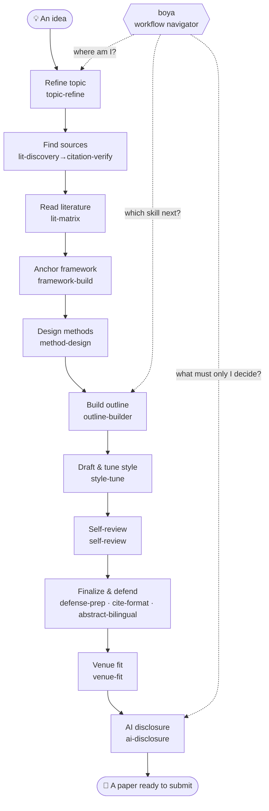

Languages: [繁體中文](README.md) | [简体中文](README.zh-CN.md) | [English](README.en.md) | [日本語](README.ja.md)

<div align="center">

# Boya 博雅

### An AI Paper Workflow for Liberal-Arts & Social-Science Researchers

**You don't need to write code. With Claude Code / Codex you can push a paper from "vague idea" to "ready to submit," step by step.**

<strong>AI does the grunt work; you make the calls.</strong><br/>
Boya helps you refine your topic, check citations, read literature, design methods, build outlines, revise drafts, self-review, and prepare for defense or submission —<br/>
but it will not fabricate references, ghostwrite conclusions, or help you hide AI use.

*A Claude Code / Codex workflow for liberal-arts and social-science researchers — from vague idea to submission-ready paper, no coding required.*

<br/>

[](https://github.com/DylanChiang-Dev/boya/stargazers)
[](https://github.com/DylanChiang-Dev/boya/network/members)
[](LICENSE)
[](#the-15-skills)
[](MEMORY.md)
[](#)

</div>

---

If you are writing a thesis or paper, Boya is not trying to turn you into an engineer. It takes the steps that supervisors, methods courses, and pre-submission checklists "never explain all at once" and turns them into agent-guided processes you can walk through.

You can start here:

- **Topic too broad:** Narrow a vague idea into a researchable question.
- **Sources a mess:** Verify citation authenticity, build a literature matrix, and map review threads.
- **Draft due soon:** Run a self-review, format citations, write an AI-use disclosure, then prepare for defense or submission.

The primary README is in Traditional Chinese: [README.md](README.md). 简体中文版见 [README.zh-CN.md](README.zh-CN.md)。日本語は [README.ja.md](README.ja.md)。

For the full usage guide see [GUIDE.md](GUIDE.md): where to start after installation, which skill to use at each research stage, and how templates / knowledge / evals fit together.

One sentence to explain what this repo does: **It takes the kind of judgment a supervisor carries — "read three papers and you know whether this topic works" — and breaks it into explicit rules and questions, written as processes you can invoke at any time.** It shrinks information gaps; it does not do your research for you.

## 🧭 Core Beliefs

> ### AI is the copilot, not the captain.

Boya's top design principle is **human-in-the-loop**: the workflow can auto-relay from one step to the next, but at every gate where "only you can decide," it **hard-stops and waits for your call** — and that is the only dividing line between Boya and a "fully automatic paper machine." The four points below are all expansions of this principle.

- **Outsource labor, keep judgment.** Skills handle search, verification, formatting, and simulated questioning; research questions, method choices, and interpretation are always yours.
- **Every citation goes back to the source.** A skill only proves a reference exists — not that it supports your argument.
- **Transparency over concealment.** Every skill encourages traceability and honest AI-use disclosure; the goal is quality, not hiding the collaboration.
- **Human-in-the-loop, not one-click.** This is not a fully automatic paper machine — the workflow auto-relays into the next step, but it stops at every gate where "only you can decide"; at each step the AI works, you steer.

## 🗺️ Workflow Map

From a rough idea to a paper ready for submission, fifteen skills each cover one stage. `boya` sits at the top as the navigator:



## 📦 The 15 Skills

> **Twelve core** (one per stage) + **two final-stage** (formatting & abstract) + **one navigator** (the spine) = **fifteen**; all fifteen skills now have real-world cases and evidence ledgers and are rated Stable.

### Core · One Per Stage

| Skill | What It Does | Stage |
|---|---|---|
| [`topic-refine`](skills/topic-refine) | Socratic topic refinement: problem awareness → bounded divergence → three convergence questions (new / feasible / who cares) → supervisor simulation → one-page research-question brief; only asks, never answers for you | Topic |
| [`lit-discovery`](skills/lit-discovery) | Literature discovery: splits a research question into search strategies, pulls a **to-verify candidate list** from OpenAlex / Crossref / Semantic Scholar, sorts by relevance tier; optionally flags "read first" source hints (cross-checks CSSCI / TSSCI / PKU Core / AMI Core / SSCI / A&HCI official lists with edition year — marks unverified as pending); hands off to verification and close reading; never fabricates, marks gaps for manual search | Sources |
| [`citation-verify`](skills/citation-verify) | Citation verification: uses Crossref / OpenAlex / Semantic Scholar public APIs to check whether references **actually exist**, catches wrong DOIs, split names, and fabricated citations | Sources |
| [`lit-matrix`](skills/lit-matrix) | Close reading & matrix: single-paper four-column notes (claim / evidence / method / challengeable points), cross-paper comparison matrix, literature-review dialogue map | Reading |
| [`framework-build`](skills/framework-build) | Theoretical framework anchoring: spreads candidate frameworks from the literature map (what it explains / theoretical cost / evidence support), recommends layering (main framework → mediating mechanism → empirical handles → landing points), hard GATE for you to choose the main framework; also offers auxiliary framework embedding and reverse health-check modes | Framework |
| [`method-design`](skills/method-design) | Research design: method map, drafts interview guides / questionnaires + human calibration, role-play pre-interviews, coding suggestions (interpretation stays with you), statistical fallacy checks | Design |
| [`outline-builder`](skills/outline-builder) | Paper skeleton: choose structure pattern (IMRaD / review / speculative / policy), generate outline, paragraph-level claim–evidence–warrant chains (bridges reasoning gaps) | Outline |
| [`style-tune`](skills/style-tune) | Voice calibration: uses your previous writing to teach AI your style, paragraph-level revision (guards the no-ghostwriting red line), Chinese academic AI-tone detection checklist | Draft |
| [`self-review`](skills/self-review) | Self-review (**simulated review**): a panel of reviewers (methodology / field / devil's advocate / editor-in-chief) takes turns + integrity self-check + issue triage (must-fix / debatable / misread) | Review |
| [`defense-prep`](skills/defense-prep) | Defense preparation: paper → presentation skeleton, layered hard questions (clarification / method / theory / contribution / traps), response strategies (including English) | Defense |
| [`venue-fit`](skills/venue-fit) | Venue-fit check: compares your manuscript against a target venue's real author guidelines, lists must-fix / should-fix / needs-check gaps; never invents journal requirements or decides where you submit | Submission |
| [`ai-disclosure`](skills/ai-disclosure) | AI-use disclosure: inventory usage → plagiarism / ghostwriting / assistance trichotomy → generate honest, specific statements in target institution format → traceability evidence | Disclosure |

### Final Stage · Formatting & Abstract

| Skill | What It Does | Stage |
|---|---|---|
| [`cite-format`](skills/cite-format) | Citation formatting: APA / Chicago / MLA conversion & full-text consistency, in-text ↔ bibliography one-to-one matching (catches orphans), marks missing fields instead of inventing them; **format only, no authenticity verification** | Format |
| [`abstract-bilingual`](skills/abstract-bilingual) | Bilingual abstract: condenses a Chinese abstract + English abstract from the final manuscript (rewritten per English conventions, not word-for-word translation) + bilingual keywords; condenses only, never adds; checks every number | Abstract |

### Navigator · The Spine

| Skill | What It Does | Stage |
|---|---|---|
| [`boya`](skills/boya) | Full-workflow navigation & entry point (formerly `research-roadmap`): determines where you are, which skill to call next, which gates only you can decide, when to pass; **guided dispatcher — auto-relays into the next skill, stops at every gate for your call**, links the other fourteen | Navigation |

## 🚀 Installation

### Option 1: Ask an Agent to Install All Boya Skills (Recommended)

Open an agent such as Claude Code or Codex and paste:

```text
Install all Boya skills from https://github.com/DylanChiang-Dev/boya, not only citation-verify. First detect my current agent environment and available skills directories, tell me which paths you will write to, and wait for my confirmation before making changes.
```

Common target paths:

- Claude Code: global `~/.claude/skills/`; project-local `.claude/skills/`
- Codex: global `~/.agents/skills/`; project-local `.agents/skills/`; Codex's built-in `$skill-installer` may instead write to `$CODEX_HOME/skills/` (commonly `~/.codex/skills/`)
- CC Switch: global `~/.cc-switch/skills/`

Use a single skill name such as `citation-verify` only when you intentionally want to install one skill instead of the full set.

### Option 2: Manually Copy the Full Skill Set

Each skill directory only needs a `SKILL.md` file.

**Codex global install (available to all projects)**

```bash
git clone https://github.com/DylanChiang-Dev/boya.git

mkdir -p ~/.agents/skills
cp -r boya/skills/* ~/.agents/skills/
```

If your Codex setup explicitly loads skills from `$CODEX_HOME/skills/`, use:

```bash
mkdir -p "${CODEX_HOME:-$HOME/.codex}/skills"
cp -r boya/skills/* "${CODEX_HOME:-$HOME/.codex}/skills/"
```

**Codex project-local install (current project only)**

```bash
mkdir -p .agents/skills
cp -r boya/skills/* .agents/skills/
```

After installation, call a skill explicitly, such as `$citation-verify`, or use natural language such as: "Check whether these references are real."

**Claude Code global install (available to all projects)**

```bash
mkdir -p ~/.claude/skills
cp -r boya/skills/* ~/.claude/skills/
```

**Claude Code project-local install (current project only)**

```bash
mkdir -p .claude/skills
cp -r boya/skills/* .claude/skills/
```

After installation, use natural language in Claude Code, for example: "Check whether these references are real."

**CC Switch global install**

```bash
mkdir -p ~/.cc-switch/skills
cp -r boya/skills/* ~/.cc-switch/skills/
```

## 🌍 Notes for International Use

The underlying methods apply broadly to humanities and social-science research, but **terminology, databases, citation styles, and AI-use policies** vary by country, university, discipline, and journal.

### Source Verification

`citation-verify` uses public APIs: Crossref, OpenAlex, and Semantic Scholar. These work well for English-language journals, preprints, and DOI-bearing records, but they cannot cover everything.

**Not found through an API does not mean a source is fake.** Books, chapters, dissertations, conference papers, government documents, newspapers, local-language journals, and archival materials often require manual checking.

Recommended manual verification channels:

- University library discovery systems.
- Publisher pages.
- Google Scholar and discipline-specific indexes.
- WorldCat and national library catalogs.
- Institutional repositories and dissertation databases.
- Government or organizational websites for policy documents and statistical reports.
- The original PDF, book, archive, or dataset whenever available.

### Citation Style

Citation style priority should be:

```text
University or department template > supervisor requirement > journal instructions > generic style guide
```

`cite-format` can help with APA, Chicago, MLA, and user-provided examples, but it should not be treated as a universal formatting authority. Give the agent the exact template or a correct sample when your institution or journal has specific requirements.

### AI-Use Disclosure

AI-use policies are changing quickly. `ai-disclosure` does not assume a universal answer. Provide the latest university, department, course, conference, or journal policy before asking the skill to draft a statement.

This repository helps you state AI use honestly. It does not help with hiding AI use, bypassing detection, disguising ghostwriting, or inventing institutional policy.

## 🔬 Tested Cases

Every skill has been run on **real research materials**, and the problems exposed have been written back into the rules — most cases come from the author's own master's thesis, serving as a real end-to-end workflow demonstration.

Validation status has three levels: `Draft` (designed, not yet evidence-backed), `Beta` (usable but still being refined), `Stable` (tested on real materials with lessons written back into the skill). All 15 skills are currently **Stable**; individual knowledge-table entries may still carry `❓/TBD` without affecting skill stability. See [`VERIFICATION.md`](VERIFICATION.md) for evidence chains, minimum evidence ledgers, source maps, and action maps.

| # | Case | One-Line Result |
|---|---|---|
| 001 | [citation-verify on author's master's thesis](examples/2026-06-12-master-thesis-case.md) | Full check of 47 references; caught **3 wrong DOIs**, 1 split name, 11 incomplete records; public errata attached |
| 002 | [lit-matrix on thesis literature](examples/2026-06-13-litmatrix-thesis-litreview.md) | 5 heterogeneous papers grouped into a matrix; exposed "citation context ≠ topic / heterogeneous corpus grouping" |
| 003 | [self-review on a teaching chapter](examples/2026-06-13-selfreview-teaching-chapter.md) | Exposed "genre mismatch / evidence-claim scale mismatch / absolute claims" |
| 004 | [defense-prep simulating thesis defense](examples/2026-06-14-defenseprep-thesis.md) | Layered real exam questions; exposed "stage misjudgment / missing qualitative generalizability" |
| 005 | [topic-refine on a "cross-strait relations" topic](examples/2026-06-14-topicrefine-cross-strait.md) | Hit a feasibility red light on "Japan-Taiwan informal security" (closed data); demonstrated reframing while preserving the question |
| 006 | [method-design reviewing thesis design](examples/2026-06-14-methoddesign-thesis.md) | Exposed "think through participant stratification / AI interviewee too compliant" |
| 007 | [outline-builder reviewing thesis skeleton](examples/2026-06-14-outlinebuilder-thesis.md) | Exposed "completeness illusion (comprehensive ≠ argument thread) / missing warrants" |
| 008 | [style-tune scanning thesis for AI tone](examples/2026-06-14-styletune-thesis.md) | A thesis on GenAI whose own introduction reads like AI-generated text; exposed "AI tone's professional disguise" |
| 009 | [ai-disclosure for heavy AI collaboration](examples/2026-06-14-aidisclosure-heavy-ai-use.md) | Exposed "AI downplays when use is heavy" |
| 010 | [abstract-bilingual on thesis abstracts](examples/2026-06-14-abstractbilingual-thesis.md) | Caught "official keywords misaligned between Chinese and English / 'significant' is a stats term — don't copy blindly" |
| 011 | [cite-format on thesis bibliography](examples/2026-06-14-citeformat-thesis.md) | Confirmed "verify before formatting — an unverified list is just a pretty wrapper for wrong data" |
| 012 | [boya (formerly research-roadmap) navigating a full workflow](examples/2026-06-14-researchroadmap-workflow.md) | Caught the biggest degeneration "table-of-contents reciter" — must locate by output artifacts, not linear order |
| 013 | [venue-fit on thesis vs. Journal of Public Administration](examples/2026-06-18-venuefit-thesis-jpa.md) | Confirmed "never invent author guidelines" and "detect thesis-to-journal genre gap first"; first venue-fit live test |
| 014 | [framework-build anchoring a Japan-Taiwan semiconductor framework](examples/2026-06-21-framework-jasm.md) | Solidified framework anchoring: no framework salad, no invented load-bearing literature, hard GATE for researcher's main-framework choice |
| 015 | [outline-builder building a speculative silicon-sampling outline](examples/2026-06-27-outlinebuilder-silicon-sampling.md) | Positive skeleton-building test of topic-sentence-first; hit two speculative-type pitfalls: concession sentences posing as topic sentences, paragraph topic sentences parroting chapter thesis |
| 016 | [lit-discovery full-chain Chinese-title exploration](examples/2026-06-30-litdiscovery-genai-assessment-taiwan.md) | Precise Chinese title reverse-lookup hit real DOIs; filled the "Chinese-title discovery → candidate tiering → venue pending" full chain |
| 017 | [framework-build on Taiwan carbon-fee policy framework](examples/2026-06-30-framework-carbon-fee-policy.md) | Filled the policy-analysis branch: policy problem, analysis dimensions, evaluation criteria, policy costs, and GATE all passed |
| 018 | [venue-fit benchmarking a JALT English higher-ed assessment paper](examples/2026-06-30-venuefit-jalt-genai-assessment.md) | Checked JALT submissions page; confirmed article page ≠ author guidelines, AI disclosure & APA 7 must trace to real sources |

## 🧱 Design Principles

- **Human-in-the-loop:** The repository's highest principle — the workflow auto-relays into the next step, but at every gate where "only you can decide" it hard-stops and waits for your call. This is the dividing line between Boya and a "fully automatic paper machine"; all remaining principles serve this one.
- **Single-file skills:** Each skill is one `SKILL.md` — readable, editable, and fork-friendly.
- **No fabrication:** Every skill has a built-in hard rule: "if not found, mark it; if uncertain, say so."
- **Use → test → write:** Every skill is first run on real materials; problems are written back into the rules before the version number goes up — no armchair framework building.
- **Chinese-first:** Designed for Chinese-language humanities and social-science research contexts (including Taiwan's academic citation and policy environment).
- **Lightweight reference layer:** `VERIFICATION.md` summarizes tested evidence, `knowledge/` holds venue and Chinese academic writing cheat sheets, `templates/` holds fill-in-the-blank paper and defense skeletons.
- **No heavy automation framework:** No `_shared/` fragments, `manifest.yaml` split loading, or long-running multi-agent orchestrators; shared material is extracted only if a specific skill truly becomes unreadable.

## 💬 Join the Discussion

Questions, usage feedback, or want to share your forked version? Jump into the chat:

<table>
<tr>
<td align="center"><b>WeChat Group</b><br/>Boya Skills<br/><sub>(QR codes expire periodically — if expired, open an issue and the author will update)</sub></td>
<td align="center"><b>Telegram Group</b></td>
</tr>
<tr>
<td align="center"></td>
<td align="center"></td>
</tr>
</table>

## ⭐ Star History

If this repo helps you, leave a star — so more humanities students stuck in their papers, with no one to talk to, can find it.

[](https://star-history.com/#DylanChiang-Dev/boya&Date)

## 🏷️ Versioning

| Version | Meaning |
|---|---|
| `0.0.X` | Refinement round — any skill tested and revised bumps the patch number |
| `0.X.0` | New skill release or workflow structure change |
| `1.0.0` | Stable full skill set |

Each version is git-tagged; changelog is in [`MEMORY.md`](MEMORY.md#changelog).

## 📄 License & Acknowledgements

**MIT License** (Copyright Dylan Chiang 蔣濤) — free to use, modify, and redistribute (including commercial use); keep the copyright notice.

Workflow ideas were inspired by the following public projects and research, with thanks:

- [**academic-research-skills**](https://github.com/Imbad0202/academic-research-skills) (ARS) — integrity gates and citation-verification direction
- [**Supervisor-Skills**](https://github.com/HKUSTDial/Supervisor-Skills) (HKUST) — encoding supervisor judgment as skills; pre-submission self-review (simulated review) concept
- **The AI Scientist** (Lu et al., 2024, [arXiv:2408.06292](https://arxiv.org/abs/2408.06292), Sakana AI) — failure modes of fully automated research
- **Zhao et al. (2026)** — large-scale empirical work on hallucinated citations
- [**Peng Sida's public research notes**](https://pengsida.notion.site/c1a22465a0fa4b15a12985223916048e) — paragraph writing methodology (topic-sentence-first, reverse outline) as conceptual inspiration; only the method idea is borrowed — rules and prose are originally written

> Only conceptual direction and problem awareness are borrowed; **prompts, structure, and cases are entirely original** — zero content paraphrasing, no copied prompts, no screenshots. This distinction is part of the academic integrity this repository insists on.
