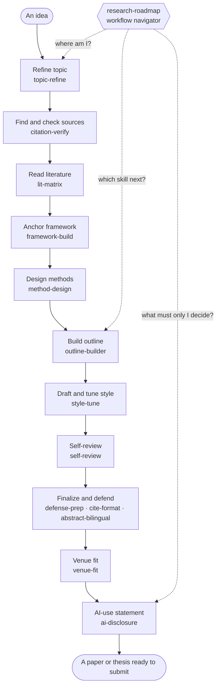

Languages: [繁體中文](README.md) | [简体中文](README.zh-CN.md) | [English](README.en.md) | [日本語](README.ja.md)

<div align="center">

# Boya · AI Research Skills for Liberal Arts Researchers

### The Liberal-Arts AI Research Workflow

**A Claude Code / Codex skill collection for humanities and social-science researchers who do not write code: from topic refinement and source checking to literature review, research design, drafting, self-review, and defense preparation.**

<br/>

[](https://github.com/DylanChiang-Dev/boya/stargazers)
[](https://github.com/DylanChiang-Dev/boya/network/members)
[](LICENSE)
[](#the-14-skills)
[](MEMORY.md)
[](#)

</div>

---

> This repository is a set of AI research skills for humanities and social-science researchers. It turns a full research workflow into reusable agent skills: refining a topic, checking citations, reading literature, designing methods, building an outline, drafting, reviewing, formatting, writing abstracts, preparing for defense, and disclosing AI use. The skills can be used in Claude Code, Codex, and other environments that support agent skills.

The core idea: **make tacit supervisor-like judgment more explicit.** These skills break research guidance into rules, checks, questions, and handoff points that an AI agent can run with you. They reduce information gaps, but they do not replace your research judgment.

## Who This Is For

- Humanities and social-science students, researchers, instructors, and independent scholars.
- Master's and doctoral students writing coursework papers, thesis proposals, dissertations, journal manuscripts, or conference papers.
- Researchers who want AI help without turning their work into ghostwritten text.
- People who need a concrete workflow rather than another generic prompt collection.

## Core Beliefs

> ### AI is the copilot, not the captain.

- **Outsource labor, keep judgment.** Skills can help with search planning, verification, formatting, simulated questioning, and review. Research questions, method choices, interpretation, and final claims stay with you.
- **Every citation goes back to the source.** A skill can help establish that a source exists. It cannot prove that the source supports your argument.
- **Transparency over concealment.** The workflow encourages traceable collaboration and honest AI-use statements.
- **Human-led, not one-click.** This is not an automatic paper machine. The AI does work; you steer.

## Workflow Map

From a rough idea to a thesis or paper ready for submission, the 14 skills each cover one part of the workflow. `research-roadmap` sits above them as the navigator.



## The 14 Skills

> **Eleven core skills** + **two final-stage skills** + **one navigator** = **14 skills**. Twelve are Stable, `venue-fit` is Beta, and `framework-build` is Draft.

### Core Skills

| skill | What it does | Stage |
|---|---|---|
| [`topic-refine`](skills/topic-refine) | Socratic topic refinement: problem awareness, bounded divergence, three convergence questions (new / feasible / who cares), supervisor-style questioning, and a one-page research-question brief. | Topic |
| [`citation-verify`](skills/citation-verify) | Citation verification with Crossref, OpenAlex, Semantic Scholar, and related public sources. Flags wrong DOIs, split names, suspicious references, and items that need manual source checking. | Sources |
| [`lit-matrix`](skills/lit-matrix) | Close reading and literature matrices: claim / evidence / method / challenge notes, cross-paper comparison, and literature-review dialogue maps. | Reading |
| [`framework-build`](skills/framework-build) | Theoretical framework anchoring: turns a literature map into candidate frameworks, compares what each explains, its theoretical cost, and evidence support, recommends a layered structure, and stops at a hard gate for you to choose the main framework. | Framework |
| [`method-design`](skills/method-design) | Research design support: method maps, interview or survey drafts for human calibration, pre-interview role play, coding suggestions, statistical fallacy checks, and ethics prompts. | Design |
| [`outline-builder`](skills/outline-builder) | Thesis or paper structure: IMRaD, review, theoretical, and policy-analysis structures; chapter outline; paragraph-level claim-evidence-warrant chains. | Outline |
| [`style-tune`](skills/style-tune) | Voice calibration: learns from your previous writing, supports paragraph-level revision, and flags generic AI academic style. | Draft |
| [`self-review`](skills/self-review) | Simulated review: methodology reviewer, field reviewer, devil's advocate, and editor-in-chief roles, plus integrity checks and issue triage. | Review |
| [`defense-prep`](skills/defense-prep) | Defense preparation: presentation skeleton, layered hard questions, and response strategies, including English Q&A support. | Defense |
| [`venue-fit`](skills/venue-fit) | Venue-fit checking: compares a manuscript with a target venue’s real author guidelines, producing must-fix, should-fix, and needs-check gaps without inventing journal requirements. | Submission |
| [`ai-disclosure`](skills/ai-disclosure) | AI-use statement support: usage inventory, assistance vs. authorship distinction, institution- or journal-specific statements, and traceability notes. | Disclosure |

### Final-Stage Skills

| skill | What it does | Stage |
|---|---|---|
| [`cite-format`](skills/cite-format) | Citation formatting: APA, Chicago, MLA, or user-provided templates; checks in-text citations against bibliography entries; formats without inventing missing data. | Formatting |
| [`abstract-bilingual`](skills/abstract-bilingual) | Bilingual abstract support: condenses from the final manuscript, writes English abstracts according to English academic conventions, aligns keywords, and checks numbers and proper names. | Abstract |

### Navigator

| skill | What it does | Stage |
|---|---|---|
| [`research-roadmap`](skills/research-roadmap) | Full-workflow navigation: determines where you are, which skill to call next, what output proves the stage is done, and which decisions must stay with you. Acts as a guided dispatcher — auto-relays into the next skill so you are walked one skill at a time, but stops at every decision gate for you to decide. | Navigation |

## Installation

### Option 1: Ask an Agent to Install All Boya Skills

Open Claude Code, Codex, or CC Switch and paste:

```text
Install all Boya skills from https://github.com/DylanChiang-Dev/boya, not only citation-verify. First detect whether I am using Claude Code, Codex, or CC Switch, tell me which skills directories you will write to, and wait for my confirmation before making changes.
```

Common target paths:

- Claude Code: global `~/.claude/skills/`; project-local `.claude/skills/`
- Codex: global `~/.agents/skills/`; project-local `.agents/skills/`; Codex's built-in `$skill-installer` may instead write to `$CODEX_HOME/skills/` (commonly `~/.codex/skills/`)
- CC Switch: global `~/.cc-switch/skills/`

Use a single skill name such as `citation-verify` only when you intentionally want to install one skill instead of the full set.

### Option 2: Manually Copy the Full Skill Set

Each skill directory only needs a `SKILL.md` file.

**Codex global install**

```bash
git clone https://github.com/DylanChiang-Dev/boya.git

mkdir -p ~/.agents/skills
cp -r boya/skills/* ~/.agents/skills/
```

If your Codex setup explicitly loads skills from `$CODEX_HOME/skills/`, use:

```bash
mkdir -p "${CODEX_HOME:-$HOME/.codex}/skills"
cp -r boya/skills/* "${CODEX_HOME:-$HOME/.codex}/skills/"
```

**Codex project-local install**

```bash
mkdir -p .agents/skills
cp -r boya/skills/* .agents/skills/
```

After installation, call a skill explicitly, such as `$citation-verify`, or use natural language such as: "Check whether these references are real."

**Claude Code global install**

```bash
mkdir -p ~/.claude/skills
cp -r boya/skills/* ~/.claude/skills/
```

**Claude Code project-local install**

```bash
mkdir -p .claude/skills
cp -r boya/skills/* .claude/skills/
```

After installation, use natural language in Claude Code, for example: "Check whether these references are real."

**CC Switch global install**

```bash
mkdir -p ~/.cc-switch/skills
cp -r boya/skills/* ~/.cc-switch/skills/
```

## Notes for International Use

The workflow is designed for humanities and social-science research, but citation systems, disclosure policies, and databases differ by country, university, discipline, and journal.

### Source Verification

`citation-verify` uses public sources such as Crossref, OpenAlex, and Semantic Scholar. These are useful for many journal articles, books, preprints, and DOI-bearing records, but they are not complete.

**Not found through an API does not mean the source is fake.** Books, chapters, dissertations, conference papers, government documents, newspapers, local-language journals, and archival materials often require manual checking.

Recommended manual source checks include:

- University library discovery systems.
- Publisher pages.
- Google Scholar and discipline-specific indexes.
- WorldCat and national library catalogs.
- Institutional repositories and dissertation databases.
- Government or organizational websites for policy documents and statistical reports.
- The original PDF, book, archive, or dataset whenever available.

### Citation Style

Citation priority should be:

```text
University or department template > supervisor requirement > journal instructions > generic style guide
```

`cite-format` can help with APA, Chicago, MLA, and user-provided examples, but it should not be treated as a universal formatting authority. Give the agent the exact template or a correct sample when your institution or journal has specific requirements.

### AI-Use Disclosure

AI-use policies are changing quickly. `ai-disclosure` does not assume a universal answer. Provide the latest university, department, course, conference, or journal policy before asking the skill to draft a statement.

This repository helps you state AI use honestly. It does not help with hiding AI use, bypassing detection, disguising ghostwriting, or inventing institutional policy.

## Tested Cases

Each skill has been tested on real research materials, including thesis references, literature-review drafts, teaching manuscripts, and workflow cases.

Validation status has three levels: `Draft` (designed but not yet evidence-backed), `Beta` (usable but still being refined), and `Stable` (tested on real materials, with lessons written back into the skill). 12 current skills are **Stable**, `venue-fit` is **Beta**, and `framework-build` is **Draft**. See [`VERIFICATION.md`](VERIFICATION.md) for the evidence chain, minimum evidence ledger, source map, and action map conventions.

| # | Case | Result |
|---|---|---|
| 001 | [citation-verify on a master's thesis bibliography](examples/2026-06-12-master-thesis-case.md) | Checked 47 references; found wrong DOIs, split names, incomplete records, and duplicates. |
| 002 | [lit-matrix on thesis literature](examples/2026-06-13-litmatrix-thesis-litreview.md) | Built comparison matrices and exposed the difference between citation context and paper topic. |
| 003 | [self-review on a teaching chapter](examples/2026-06-13-selfreview-teaching-chapter.md) | Found genre mismatch, evidence-claim scale problems, and over-absolute claims. |
| 004 | [defense-prep on a thesis draft](examples/2026-06-14-defenseprep-thesis.md) | Produced layered defense questions and highlighted qualitative generalizability issues. |
| 005 | [topic-refine on a cross-strait relations topic](examples/2026-06-14-topicrefine-cross-strait.md) | Exposed feasibility problems around inaccessible data and reframed the topic. |
| 006 | [method-design on a thesis design](examples/2026-06-14-methoddesign-thesis.md) | Flagged unclear participant grouping and overly compliant AI role-play answers. |
| 007 | [outline-builder on a thesis structure](examples/2026-06-14-outlinebuilder-thesis.md) | Found completeness illusion and missing warrants. |
| 008 | [style-tune on thesis prose](examples/2026-06-14-styletune-thesis.md) | Detected generic AI academic style in a thesis about GenAI. |
| 009 | [ai-disclosure for heavy AI collaboration](examples/2026-06-14-aidisclosure-heavy-ai-use.md) | Showed that AI tends to understate heavy AI use unless instructed otherwise. |
| 010 | [abstract-bilingual on a thesis abstract](examples/2026-06-14-abstractbilingual-thesis.md) | Found keyword mismatch and misuse of statistically loaded language. |
| 011 | [cite-format on a thesis bibliography](examples/2026-06-14-citeformat-thesis.md) | Confirmed that formatting must come after verification. |
| 012 | [research-roadmap across the full workflow](examples/2026-06-14-researchroadmap-workflow.md) | Avoided becoming a process reciter by locating stages through actual outputs. |
| 013 | [venue-fit on a thesis and Journal of Public Administration](examples/2026-06-18-venuefit-thesis-jpa.md) | Confirmed that venue-fit must not invent author guidelines and must first detect the thesis-to-journal genre gap. |
| 014 | [framework-build anchors a Japan-Taiwan semiconductor framework](examples/2026-06-21-framework-jasm.md) | Captures framework anchoring rules: no framework salad, no invented load-bearing literature, and a hard gate for the researcher’s main-framework choice. |

## Design Principles

- **Single-file skills:** each skill is a `SKILL.md` that can be read, modified, and forked.
- **No fabrication:** missing or uncertain information must be marked, not invented.
- **Use, test, revise:** rules are updated after running skills on real materials.
- **Humanities and social sciences first:** built for interpretation-heavy research, not only lab-style workflows.
- **Multilingual entry, single skill source:** README files may be localized, but the 14 skills remain one maintained set.
- **Lightweight reference layer:** `VERIFICATION.md` summarizes tested evidence, `knowledge/` stores venue and Chinese academic-style reference cards, and `templates/` provides fill-in paper and defense skeletons.
- **No heavy automation framework:** Boya does not adopt `_shared/` fragments, `manifest.yaml` loading, or long-running multi-agent orchestration unless a specific skill becomes too large to read directly.

## Versioning

| Version | Meaning |
|---|---|
| `0.0.X` | Testing and refinement round. |
| `0.X.0` | New skill or workflow structure change. |
| `1.0.0` | Stable full skill set. |

Changelog notes are kept in [`MEMORY.md`](MEMORY.md#changelog).

## License and Acknowledgements

**MIT License**. Copyright Dylan Chiang.

This work is inspired by public projects and research including:

- [**academic-research-skills**](https://github.com/Imbad0202/academic-research-skills) for integrity gates and citation-verification direction.
- [**Supervisor-Skills**](https://github.com/HKUSTDial/Supervisor-Skills) for the idea of encoding supervisor-like judgment into skills and pre-submission review.
- **The AI Scientist** (Lu et al., 2024, [arXiv:2408.06292](https://arxiv.org/abs/2408.06292), Sakana AI) for failure modes of fully automated research.
- **Zhao et al. (2026)** for large-scale empirical work on hallucinated citations.

The prompts, structure, and cases in this repository are original.
