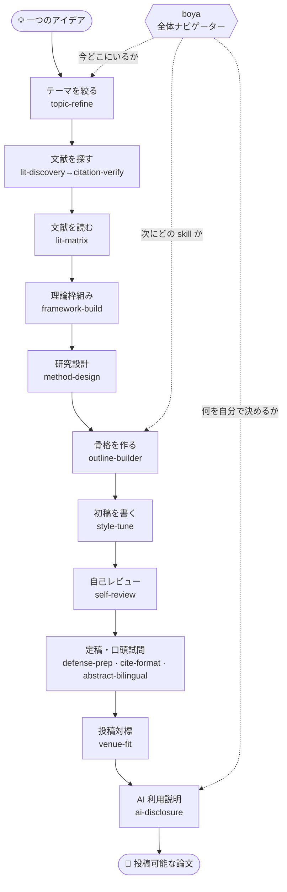

言語: [繁體中文](README.md) | [简体中文](README.zh-CN.md) | [English](README.en.md) | [日本語](README.ja.md)

<div align="center">

# Boya 博雅

### 文系・人文社会科学系研究者のための AI 論文ワークフロー

**コードを書かなくても、Claude Code / Codex で論文を「ぼんやりしたテーマ」から「提出できる状態」まで一歩ずつ進められます。**

<strong>AI が作業を担い、あなたが判断する。</strong><br/>
Boya はテーマの絞り込み、引用確認、文献読解、方法設計、アウトライン作成、初稿修正、自己レビュー、口頭試問・投稿準備を手伝います。<br/>
ただし、文献の捏造、結論の代筆、AI 利用の隠蔽には加担しません。

*A Claude Code / Codex workflow for liberal-arts and social-science researchers — from vague idea to submission-ready paper, no coding required.*

<br/>

[](https://github.com/DylanChiang-Dev/boya/stargazers)
[](https://github.com/DylanChiang-Dev/boya/network/members)
[](LICENSE)
[](#15-個の-skill)
[](MEMORY.md)
[](#)

</div>

---

論文を書いているなら、Boya はあなたをエンジニアに変えようとしているのではありません。指導教員、研究方法の授業、投稿前チェックリストにある「誰も一度に全部は説明してくれない」ステップを、agent が一緒に歩けるプロセスに分解したものです。

ここから始められます：

- **テーマが広すぎる**：漠然としたアイデアを研究可能な問いに絞り込む。
- **文献が散らかっている**：引用の真偽を確認し、文献マトリクスとレビューの筋道を整理する。
- **初稿の締切が近い**：自己レビュー、引用形式の整理、AI 利用説明を先に済ませ、口頭試問や投稿に備える。

メインの README は繁体字中国語です：[README.md](README.md)。简体中文版は [README.zh-CN.md](README.zh-CN.md)、English は [README.en.md](README.en.md)。

詳しい使用ガイドは [GUIDE.md](GUIDE.md) をご覧ください：インストール後どこから始めるか、研究段階ごとにどの skill を使うか、templates / knowledge / evals の組み合わせ方。

一言でこのリポジトリの目的を説明すると：**指導教員が持っている「論文を 3 本読めばこのテーマが成立するか分かる」という判断を、できるだけ明確なルールと問いかけに分解し、いつでも呼び出せるプロセスとして書き下ろしたもの。** 情報格差を縮めますが、研究そのものを代行するわけではありません。

## 🧭 基本方針

> ### AI は副操縦士であり、機長ではない。

Boya の最上位の設計原則は**ヒューマン・イン・ザ・ループ（human-in-the-loop）**です。ワークフローは自動的に次のステップへ引き継げますが、「あなたにしか決められない」関門では必ず**ハードストップしてあなたの判断を待ちます**——これが Boya と「全自動論文生成機」の唯一の境界線です。以下の 4 項目はすべてこの原則の展開です。

- **作業は AI、判断は人間。** skill は検索、確認、形式整理、模擬質問を処理します。研究課題、方法の選択、解釈は常にあなたのものです。
- **引用は必ず原典に戻る。** skill は文献の存在を証明するだけで、それがあなたの主張を支えるかは証明しません。
- **隠すのではなく説明する。** すべての skill はトレーサビリティと AI 利用の正直な説明を推奨します。目的は品質であり、協力の事実を隠すことではありません。
- **ヒューマン・イン・ザ・ループ、ワンクリックではない。** これは全自動論文生成機ではありません——ワークフローは次のステップへ自動的に引き継ぎますが、「あなたにしか決められない」関門では停止します。各ステップで AI が作業し、あなたがハンドルを握ります。

## 🗺️ ワークフローマップ

一つのアイデアから投稿可能な論文まで、15 個の skill がそれぞれ一段階を担当し、`boya` が最上層でナビゲートします：



## 📦 15 個の skill

> **12 個のコア**（段階ごとの作業）＋ **2 個の仕上げ**（定稿段階）＋ **1 個のナビゲーター**（背骨）＝ **15 個**。現在 15 個すべてが実際の事例と evidence ledger を備え、Stable です。

### コア · 一段階に一つ

| skill | 内容 | 段階 |
|---|---|---|
| [`topic-refine`](skills/topic-refine) | ソクラテス式テーマ絞り込み：問題意識 → 有界発散 → 三問収束（新しいか／実行可能か／誰が気にするか）→ 指導教員シミュレーション → 研究問題一枚ブリーフ；問い続けるだけで答えは出さない | テーマ |
| [`lit-discovery`](skills/lit-discovery) | 文献探索：研究の問いを検索戦略に分解し、OpenAlex / Crossref / Semantic Scholar から**要確認の候選リスト**を収集して関連度で層別；「先に読むべき論文」の出典ヒント（CSSCI / TSSCI / 北大核心 / AMI核心 / SSCI / A&HCI 公式リストで版次・年を照合、確認できなければ「要確認」と表示）を選択的に提示し、確認・精読へ引き継ぎ；捏造せず、カバーされない項目は手動検索用に印を付ける | 文献探索 |
| [`citation-verify`](skills/citation-verify) | 引用確認：Crossref / OpenAlex / Semantic Scholar の公開 API で参考文献が**実在するか**検証し、DOI ミス・著者名分割・捏造引用を捕捉する | 文献確認 |
| [`lit-matrix`](skills/lit-matrix) | 精読とマトリクス：単一論文の四欄ノート（主張／証拠／方法／反論可能点）、複数論文比較マトリクス、レビュー対話マップ | 文献読解 |
| [`framework-build`](skills/framework-build) | 理論枠組み定錨：文献地図から候補枠組みを並べ（何を説明するか／理論的代償／エビデンスの裏付け）、階層推奨（主枠組み→媒介メカニズム→実証的取っ手→着地点）、硬い GATE で主枠組みの選択はあなたに委ねる；補助枠組み嵌入と逆向き体検の二つのモードもある | 理論枠組み |
| [`method-design`](skills/method-design) | 研究設計：方法地図、インタビューガイド／質問紙の起草＋人間による校正、ロールプレイ予備インタビュー、コーディング提案（解釈はあなたに）、統計的誤謬チェック | 研究設計 |
| [`outline-builder`](skills/outline-builder) | 論文骨格：構造パターン選択（IMRaD／レビュー／思弁／政策分析）、アウトライン生成、段落レベルの claim–evidence–warrant チェーン（推論の橋を補う） | アウトライン |
| [`style-tune`](skills/style-tune) | 文体校正：過去の文章から AI にあなたの文体を学ばせ、段落レベルの修正（丸ごと代筆の赤線を守る）、中国語学術 AI 調検出チェックリスト | 初稿 |
| [`self-review`](skills/self-review) | 自己レビュー（**模擬審査**）：審査員パネル（方法論／分野／悪魔の代弁者／編集長）が順番にレビュー＋誠実性自己チェック＋意見のトリアージ（必修正／議論可能／誤読） | 自己レビュー |
| [`defense-prep`](skills/defense-prep) | 口頭試問準備：論文 → 発表骨格、階層的に難問を出す（確認／方法／理論／貢献／罠）、回答戦略（英語を含む） | 口頭試問 |
| [`venue-fit`](skills/venue-fit) | 投稿対標：完成稿を対象 venue の実際の投稿規程と照合し、must-fix／should-fix／確認待ちの差分を整理；投稿規程の捏造はせず、投稿先の決定も代行しない | 投稿 |
| [`ai-disclosure`](skills/ai-disclosure) | AI 利用説明：利用の棚卸し → 盗用／代筆／補助の三分法 → 対象機関の形式で正直かつ具体的な声明を生成 → トレーサビリティ証拠 | AI 利用説明 |

### 仕上げ · 定稿段階

| skill | 内容 | 段階 |
|---|---|---|
| [`cite-format`](skills/cite-format) | 引用形式整理：APA／Chicago／MLA 変換と全文統一、本文中引用↔文末リストの一対一対応（孤立項目を捕捉）、欠落フィールドは捏造せず注記する；**形式のみ、真偽確認は別** | 形式 |
| [`abstract-bilingual`](skills/abstract-bilingual) | 中英二言語要旨：定稿から中文要旨＋英文要旨（英語の慣例に沿って書き直す、逐語翻訳ではない）＋中英キーワード；濃縮のみ、新規追加なし、数字は一つずつ照合 | 要旨 |

### ナビゲーター · 背骨

| skill | 内容 | 段階 |
|---|---|---|
| [`boya`](skills/boya) | 全体ナビゲーションとエントリポイント（旧 `research-roadmap`）：あなたがどの段階にいるか、次にどの skill を呼ぶか、どの関門はあなたにしか決められないか、いつ通過するかを判断；**ガイド付きディスパッチャー——自動的に次の skill へ引き継ぎ、各関門であなたの判断を待って停止**、残り 14 個を一つに繋ぐ | ナビゲーション |

## 🚀 インストール

### 方法 1：agent に全 Boya skill のインストールを依頼する（推奨）

Claude Code や Codex などの agent に次のように依頼します：

```text
https://github.com/DylanChiang-Dev/boya から Boya の全 skill をインストールしてください。citation-verify だけをインストールしないでください。まず現在の agent 環境と利用可能な skills ディレクトリを判断し、書き込むパスを説明して、確認を待ってから実行してください。
```

よく使う保存先：

- Claude Code：全体 `~/.claude/skills/`；プロジェクト内 `.claude/skills/`
- Codex：全体 `~/.agents/skills/`；プロジェクト内 `.agents/skills/`；Codex の組み込み `$skill-installer` を使う場合は `$CODEX_HOME/skills/`（よくある既定値は `~/.codex/skills/`）に書き込むこともあります
- CC Switch：全体 `~/.cc-switch/skills/`

`citation-verify` など単一の skill 名を指定するのは、15 個すべてではなく 1 個だけ入れたい場合に限ります。

### 方法 2：全 skill を手動でコピーする

各 skill ディレクトリには `SKILL.md` が入っています。

**Codex 全体インストール（全プロジェクト共用）**

```bash
git clone https://github.com/DylanChiang-Dev/boya.git

mkdir -p ~/.agents/skills
cp -r boya/skills/* ~/.agents/skills/
```

Codex が `$CODEX_HOME/skills/` から skill を読み込む設定の場合：

```bash
mkdir -p "${CODEX_HOME:-$HOME/.codex}/skills"
cp -r boya/skills/* "${CODEX_HOME:-$HOME/.codex}/skills/"
```

**Codex プロジェクト内インストール（現在のプロジェクトのみ）**

```bash
mkdir -p .agents/skills
cp -r boya/skills/* .agents/skills/
```

インストール後は、`$citation-verify` のように明示的に呼び出すか、「この参考文献が実在するか確認して」のように自然言語で依頼できます。

**Claude Code 全体インストール（全プロジェクト共用）**

```bash
mkdir -p ~/.claude/skills
cp -r boya/skills/* ~/.claude/skills/
```

**Claude Code プロジェクト内インストール（現在のプロジェクトのみ）**

```bash
mkdir -p .claude/skills
cp -r boya/skills/* .claude/skills/
```

インストール後は Claude Code で自然言語で依頼できます。例：「この参考文献が実在するか確認して」。

**CC Switch 全体インストール**

```bash
mkdir -p ~/.cc-switch/skills
cp -r boya/skills/* ~/.cc-switch/skills/
```

## 🇯🇵 日本語環境で使うときの注意

この README は日本語の入口です。日本の大学院制度、各大学の様式、学会・投稿規定、研究倫理方針を完全に網羅するものではありません。

### 文献確認

`citation-verify` は Crossref / OpenAlex / Semantic Scholar などの公開 API を使います。英語論文や DOI のある文献には有効ですが、日本語文献、書籍、紀要、学位論文、政府資料、新聞記事、アーカイブ資料は API だけでは確認できないことがあります。

**API で見つからないことは、文献が存在しないことを意味しません。** 日本語資料では、必要に応じて次のような経路で原典確認してください。

- CiNii Research
- J-STAGE
- IRDB
- 大学図書館の蔵書検索
- 各大学の機関リポジトリ
- 国立国会図書館サーチ
- 出版社ページ
- 政府・自治体・省庁の公式ページ

### 引用形式

引用形式の優先順位：

```text
大学・研究科・授業の指定様式 > 指導教員の指示 > 投稿先の規定 > 一般的なスタイル
```

`cite-format` は形式整理を補助しますが、大学や投稿先の正式ルールを自動で知っているわけではありません。使うときは、指定様式、投稿規定、または正しいサンプルを agent に渡してください。

### AI 利用説明

大学、授業、学会、投稿先によって AI 利用の扱いは異なり、今後も変わります。`ai-disclosure` を使うときは、最新の方針文を一緒に渡してください。

このリポジトリは AI 利用を正直に説明するための補助をします。AI 利用を隠す、検出を回避する、代筆を軽い校正のように見せる、といった用途は扱いません。

## 🔬 実測事例

すべての skill は**実際の研究材料**で検証済みで、見つかった問題はルールに書き戻されています——多くのケースは著者自身の修士論文を使っており、ワークフロー全体を通した実際のデモンストレーションです。

検証状態は三段階：`Draft`（設計段階、まだ証拠チェーン未形成）、`Beta`（利用可能だが調整中）、`Stable`（実際の材料で検証し、教訓をルールに反映済み）。現在 15 個すべてが **Stable** です。知識テーブル内の個別事実は `❓/要確認` が残ることがありますが、skill の安定状態には影響しません。証拠チェーン、最小 evidence ledger、source map / action map の規格は [`VERIFICATION.md`](VERIFICATION.md) にまとめています。

| # | 事例 | 一言の成果 |
|---|---|---|
| 001 | [citation-verify で著者の修論を全量確認](examples/2026-06-12-master-thesis-case.md) | 47 件を全量核査、**DOI ミス 3 件**・著者名分割 1 件・出典不全 11 件を捕捉、公開正誤表付き |
| 002 | [lit-matrix で修論文献を整理](examples/2026-06-13-litmatrix-thesis-litreview.md) | 異質な 5 論文をマトリクスに；「引用コンテキスト≠テーマ／異質コーパスの分群」を暴露 |
| 003 | [self-review で教材原稿を審査](examples/2026-06-13-selfreview-teaching-chapter.md) | 「文稿タイプの不一致／証拠と主張のスケール不均衡／絶対的主張」を暴露 |
| 004 | [defense-prep で修論口頭試問をシミュレーション](examples/2026-06-14-defenseprep-thesis.md) | 階層的に本番レベルの質問を生成；「論文段階の誤判断／質的一般化可能性の欠落」を暴露 |
| 005 | [topic-refine で「両岸関係」テーマを絞り込み](examples/2026-06-14-topicrefine-cross-strait.md) | 「日台非公式安全保障」で可行性の赤信号（資料非公開）を踏み、方法を変えて問いを保つ例を示す |
| 006 | [method-design で修論の研究設計を検討](examples/2026-06-14-methoddesign-thesis.md) | 「対象の層別を詰めること／AI が被験者役で従順すぎる」を暴露 |
| 007 | [outline-builder で修論の骨格を検討](examples/2026-06-14-outlinebuilder-thesis.md) | 「完全性の幻想（網羅的≠論証線）／warrant の欠席」を暴露 |
| 008 | [style-tune で修論の AI 調を検出](examples/2026-06-14-styletune-thesis.md) | GenAI を論じる論文の緒論自体が AI 生成のように読める；「AI 調の専門的偽装」を暴露 |
| 009 | [ai-disclosure で重度 AI 協力の声明を作成](examples/2026-06-14-aidisclosure-heavy-ai-use.md) | 「重度利用時に AI が過小報告しがちなこと」を暴露 |
| 010 | [abstract-bilingual で修論の中英要旨を生成](examples/2026-06-14-abstractbilingual-thesis.md) | 「公式キーワードの中英不一致／『顕著』は統計用語、無断転用禁止」を捕捉 |
| 011 | [cite-format で修論の参考文献を整理](examples/2026-06-14-citeformat-thesis.md) | 「先に確認、後に整形——未確認リスト＝誤データのきれいな包装」を実証 |
| 012 | [boya（旧 research-roadmap）で研究ワークフロー全体をナビ](examples/2026-06-14-researchroadmap-workflow.md) | 最大の退化「目次朗読機」を捕捉——線形順序ではなく成果物で現在位置を特定すべき |
| 013 | [venue-fit で修論と『公共行政学報』を照合](examples/2026-06-18-venuefit-thesis-jpa.md) | 「投稿規程を捏造しない」「学位論文→期刊変換はまず文稿タイプを判断」を実証 |
| 014 | [framework-build で日台半導体の理論枠組みを定錨](examples/2026-06-21-framework-jasm.md) | 理論枠組み定錨を固化：枠組みサラダ禁止、承重文献の捏造禁止、硬い GATE で研究者が主枠組みを選択 |
| 015 | [outline-builder で silicon sampling 思弁型アウトラインを作成](examples/2026-06-27-outlinebuilder-silicon-sampling.md) | トピックセンテンス前置の正向実測で思弁型の二つの落とし穴を発見：譲歩文がトピックセンテンスに偽装、段落トピックセンテンスが章論点を復唱 |
| 016 | [lit-discovery で中国語タイトルの全チェーン探索](examples/2026-06-30-litdiscovery-genai-assessment-taiwan.md) | 中国語タイトルの精密逆引きで実際の DOI にヒット、「中文題探索→候補層別→venue 要確認」全チェーンを補完 |
| 017 | [framework-build で台湾炭素費政策の分析枠組み](examples/2026-06-30-framework-carbon-fee-policy.md) | 政策分析型分岐を補完：政策問題、分析次元、評価基準、政策コスト、GATE すべて通過 |
| 018 | [venue-fit で JALT 英語高等教育評価論文を照合](examples/2026-06-30-venuefit-jalt-genai-assessment.md) | JALT の submissions page を確認し、記事ページ≠投稿規程、AI 開示と APA 7 は実際の出典に遡る必要があることを実証 |

## 🧱 設計原則

- **ヒューマン・イン・ザ・ループ（human-in-the-loop）**：リポジトリ全体の最上位原則——ワークフローは自動的に次のステップへ引き継ぎますが、「あなたにしか決められない」関門では必ずハードストップしてあなたの判断を待ちます。これが Boya と「全自動論文生成機」の境界線であり、以下のすべての原則はこれに従属します。
- **単一ファイル skill**：各 skill は 1 つの `SKILL.md`。読めて、直せて、fork して自分の分野版に改造できます。
- **捏造しない**：すべての skill に「見つからなければ注記する、不確実なら説明する」というハードルールを内蔵。
- **使う→磨く→書く**：各 skill はまず実際の材料で走らせ、見つかった問題をルールに書き戻してからバージョンを上げます——机上の空論でフレームワークを作りません。
- **中国語優先**：華語圏の人文社会科学の研究シーンに合わせて設計（台湾の学術引用・政策環境を含む）。
- **軽量参照レイヤー**：`VERIFICATION.md` で実測エビデンスを集約、`knowledge/` に venue と中国語学術文体の速査カード、`templates/` に穴埋め式の論文と口頭試問骨格を配置。
- **重量級の自動化フレームワークは採用しない**：`_shared/` fragments、`manifest.yaml` による分割読み込み、長時間実行の multi-agent orchestrator は不採用。特定の skill が本当に読めない長さになった場合のみ、少量の共用材料を外部に移します。

## 💬 ディスカッションに参加

質問、使用フィードバック、自分で改良したバージョンの共有など、お気軽にどうぞ：

<table>
<tr>
<td align="center"><b>WeChat グループ</b><br/>博雅 skills<br/><sub>（QR コードには有効期限があります。期限切れの場合は issue で報告してください。著者が更新します）</sub></td>
<td align="center"><b>Telegram グループ</b></td>
</tr>
<tr>
<td align="center"></td>
<td align="center"></td>
</tr>
</table>

## ⭐ Star の推移

このリポジトリが役に立ったら、Star を押してください——論文に行き詰まり、相談できる人が身近にいない文系の学生にも見えるようにするために。

[](https://star-history.com/#DylanChiang-Dev/boya&Date)

## 🏷️ バージョン戦略

| バージョン | 意味 |
|---|---|
| `0.0.X` | 磨き込みラウンド——いずれかの skill を実測で修正すると末尾番号 +1 |
| `0.X.0` | 新 skill のリリースまたはワークフロー構造の変更 |
| `1.0.0` | 全 skill 安定版 |

各バージョンは git tag を打ちます。CHANGELOG は [`MEMORY.md`](MEMORY.md#changelog) に記録。

## 📄 ライセンスと謝辞

**MIT License**（著作権者 Dylan Chiang 蔣濤）——自由に使用、改変、再配布可能（商用含む）。著作権表示を残してください。

ワークフローの着想は以下の公開プロジェクトおよび研究から影響を受けています。感謝を申し上げます：

- [**academic-research-skills**](https://github.com/Imbad0202/academic-research-skills)（ARS）—— 誠実性ゲートと引用確認の方向性
- [**Supervisor-Skills**](https://github.com/HKUSTDial/Supervisor-Skills)（HKUST）—— 指導教員の判断を skill としてコード化する発想、投稿前自己審査（模擬審査）の趣旨
- **The AI Scientist**（Lu et al., 2024, [arXiv:2408.06292](https://arxiv.org/abs/2408.06292), Sakana AI）—— 完全自動化研究の失敗モード
- **Zhao et al.（2026）** —— 幻覚引用に関する大規模実証研究
- [**彭思達の公開研究ノート**](https://pengsida.notion.site/c1a22465a0fa4b15a12985223916048e) —— 論文段落の執筆方法（トピックセンテンス前置、逆アウトライン）の着想元；方法の考え方のみ借用し、ルールと文章はオリジナルで書き直し

> 借用したのは着想の方向性と問題意識のみです。**プロンプト、構造、事例はすべてオリジナルで自作**——内容の転記ゼロ、プロンプトのコピーなし、スクリーンショットの使用なし。この節度もまた、本リポジトリが堅持する学術的誠実さの一部です。
