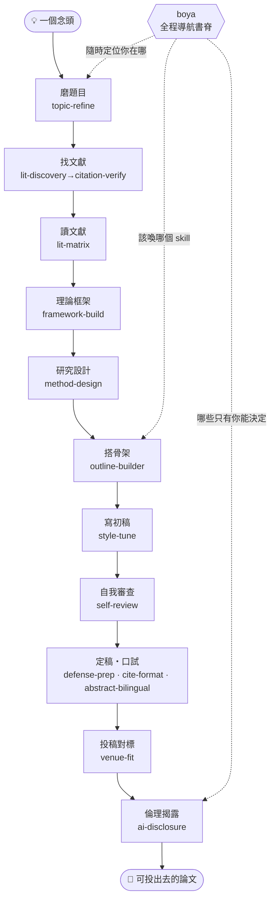

語言：[繁體中文](README.md) | [简体中文](README.zh-CN.md) | [English](README.en.md) | [日本語](README.ja.md)

<div align="center">

# 博雅 Boya

### 給文組／人文社科研究者的 AI 論文工作流

**不會寫程式，也可以用 Claude Code / Codex，把一篇論文從「模糊題目」一步步推到「可以交出去」。**

<strong>AI 做苦工，你做判斷。</strong><br/>
Boya 幫你磨題、查引用、讀文獻、設計方法、搭大綱、修初稿、自我審查、準備口試與投稿對標；<br/>
但不替你編文獻、不代寫結論、不幫你隱藏 AI 使用。

*A Claude Code / Codex workflow for liberal-arts and social-science researchers — from vague idea to submission-ready paper, no coding required.*

<br/>

[](https://github.com/DylanChiang-Dev/boya/stargazers)
[](https://github.com/DylanChiang-Dev/boya/network/members)
[](LICENSE)
[](#十五個-skill)
[](MEMORY.md)
[](#)

</div>

---

如果你正在寫論文，Boya 不是要把你變成工程師，而是把指導教授、研究方法課、投稿前檢查清單裡那些「沒人一次講清楚」的步驟，拆成 agent 可以陪你走的流程。

你可以從這裡開始：

- **題目太大**：把一個模糊想法縮成可研究問題。
- **文獻太亂**：查引用真偽，整理文獻矩陣與綜述線索。
- **初稿要交**：先自我審查、排引用格式、寫 AI 使用揭露，再準備口試或投稿。

简体中文与中国大陆高校使用说明见 [README.zh-CN.md](README.zh-CN.md)。English and Japanese introductions are available in [README.en.md](README.en.md) and [README.ja.md](README.ja.md).

完整使用手冊見 [GUIDE.md](GUIDE.md)：安裝後從哪裡開始、不同研究階段該用哪個 skill、templates / knowledge / evals 怎麼配合。

一句話講清楚這個倉庫在做什麼：**把指導教授腦子裡那種「看三篇文獻就知道這題能不能做」的判斷，盡量拆成明白的規則與提問，寫成你隨時叫得動的流程。** 它縮小資訊差，但不替你做研究。

## 🧭 核心信念

> ### AI 是副駕駛，不是機長。

Boya 的最高設計原則是**人類在環（human-in-the-loop）**：流程可以自動接力，但每一個「只有你能決定」的關卡都會**硬停下來等你拍板**——這也是它和「全自動論文機」的唯一分界。底下四條，都是這個原則的展開。

- **苦工外包，判斷自留。** skill 處理檢索、查核、格式、模擬提問；研究問題、方法選擇與詮釋，永遠是你的。
- **凡引用必回源。** skill 只證明文獻存在，不證明它支持你的論點。
- **透明而非遮掩。** 全部 skill 鼓勵留痕與 AI 使用揭露，目標是品質，不是隱藏協作事實。
- **人類在環，不是一鍵跑完。** 這不是全自動論文機——流程會自己接力喚起下一步，但到「只有你能決定」的關卡就停；每一步 AI 幹活、你握方向盤。

## 🗺️ 工作流地圖

從一個念頭到一篇可以投出去的論文，十五個 skill 各守一段，`boya` 在最上層導航：



## 📦 十五個 skill

> **十二個核心**（逐階段工作）＋ **兩個收尾**（定稿階段）＋ **一個導航**（書脊）＝ **十五個**；目前十五個 skill 均具備真實案例與 evidence ledger，列為 Stable。

### 核心 · 一階段一個

| skill | 功能 | 階段 |
|---|---|---|
| [`topic-refine`](skills/topic-refine) | 蘇格拉底式磨題：問題意識 → 有界發散 → 三問收斂（新／可行／誰在乎）→ 指導教授模擬 → 一頁研究問題簡報；只追問不給答案 | 磨題 |
| [`lit-discovery`](skills/lit-discovery) | 文獻探勘：把研究問題拆成檢索策略，用 OpenAlex / Crossref / Semantic Scholar 撈**待核候選清單**、按相關性分層；選用「先讀哪篇」出處提示（回查 CSSCI／TSSCI／北大核心／AMI核心／SSCI／A&HCI 官方名單、標版次年份，查不到標待查），交棒查核與精讀；絕不編造、查無標待人工 | 找文獻 |
| [`citation-verify`](skills/citation-verify) | 引用查核：用 Crossref / OpenAlex / Semantic Scholar 公開 API 驗證參考文獻是否**真實存在**，抓 DOI 貼錯、拆名、虛構引用 | 找文獻 |
| [`lit-matrix`](skills/lit-matrix) | 文獻精讀與矩陣：單篇四欄筆記（主張／證據／方法／可挑戰處）、跨篇對照矩陣、綜述對話地圖 | 讀文獻 |
| [`framework-build`](skills/framework-build) | 理論框架定錨：從文獻地圖攤候選框架（解釋什麼／理論代價／庫存支撐）、推薦分層（主框架→中介機制→實證抓手→落點）、硬 GATE 讓你拍板主框架；另有輔助框架嵌入與逆向體檢兩模式。 | 框架 |
| [`method-design`](skills/method-design) | 研究設計：方法地圖、起草訪談大綱／問卷＋人工校準、角色扮演預訪談、編碼建議（詮釋留你）、統計謬誤核驗 | 設計 |
| [`outline-builder`](skills/outline-builder) | 論文骨架：選結構模式（IMRaD／綜述／思辨／政策）、長出大綱、段落論證鏈 claim–evidence–warrant（專補推理橋） | 大綱 |
| [`style-tune`](skills/style-tune) | 聲音校準：用舊文讓 AI 學你的文風、段落級潤稿（守整篇代寫紅線）、中文學術 AI 腔識別清單 | 初稿 |
| [`self-review`](skills/self-review) | 自我審查（**模擬審查**）：一桌審稿人（方法論／領域／魔鬼代言人／主編）輪審＋誠信自查＋意見分級（必改／可辯／誤讀） | 自審 |
| [`defense-prep`](skills/defense-prep) | 口試準備：論文 → 簡報骨架、分層出難題（澄清／方法／理論／貢獻／陷阱）、答詢策略（含英文） | 口試 |
| [`venue-fit`](skills/venue-fit) | 投稿對標：用定稿對上目標 venue 的真實作者須知，列出 must-fix／should-fix／待補查證；不編期刊規範、不代決定投哪裡 | 投稿 |
| [`ai-disclosure`](skills/ai-disclosure) | AI 使用揭露：盤點使用 → 抄襲／代寫／輔助三分法 → 按目標機構格式生成誠實具體聲明 → 留痕自證 | 揭露 |

### 收尾 · 定稿階段

| skill | 功能 | 階段 |
|---|---|---|
| [`cite-format`](skills/cite-format) | 引用格式整理：APA／Chicago／MLA 轉換與全文統一、隨文引註↔文末清單一一對應（抓孤兒）、缺欄位標註不編造；**只管格式不驗真偽** | 格式 |
| [`abstract-bilingual`](skills/abstract-bilingual) | 中英雙語摘要：從定稿濃縮中文摘要＋英文摘要（按英文慣例重寫、非逐字翻譯）＋中英關鍵詞；只濃縮不新增、數字逐一核對 | 摘要 |

### 導航 · 書脊

| skill | 功能 | 階段 |
|---|---|---|
| [`boya`](skills/boya) | 全流程導航與入口（原 `research-roadmap`）：判斷你在哪一階段、該喚哪個 skill、哪些關卡只有你能決定、何時過關；**引導式精靈——自動接力喚起下一個 skill、每關停下等你拍板**，串起其餘十四個 | 導航 |

## 🚀 安裝

### 方式一：請 agent 自動安裝整套 Boya（推薦）

打開 Claude Code、Codex 或 CC Switch，把這句話貼進去：

```text
幫我從 https://github.com/DylanChiang-Dev/boya 安裝全部 Boya skills，不要只安裝 citation-verify。請先判斷我目前使用的是 Claude Code、Codex 還是 CC Switch，說明會寫入哪些 skills 目錄，等我確認後再執行。
```

常見目標路徑：

- Claude Code：全域 `~/.claude/skills/`；專案內 `.claude/skills/`
- Codex：全域 `~/.agents/skills/`；專案內 `.agents/skills/`；若使用 Codex 內建 `$skill-installer`，也可能寫入 `$CODEX_HOME/skills/`（預設常見為 `~/.codex/skills/`）
- CC Switch：全域 `~/.cc-switch/skills/`

只想安裝單一技能時，才把「全部 Boya skills」改成具體 skill 名，例如 `citation-verify`。

### 方式二：手動複製整套 skills

每個 skill 目錄只要包含 `SKILL.md` 就能被辨識。

**Codex 全域安裝（所有專案可用）**

```bash
git clone https://github.com/DylanChiang-Dev/boya.git

mkdir -p ~/.agents/skills
cp -r boya/skills/* ~/.agents/skills/
```

若你的 Codex 明確使用 `$CODEX_HOME/skills/` 載入技能，改用：

```bash
mkdir -p "${CODEX_HOME:-$HOME/.codex}/skills"
cp -r boya/skills/* "${CODEX_HOME:-$HOME/.codex}/skills/"
```

**Codex 專案安裝（只給當前專案用）**

```bash
mkdir -p .agents/skills
cp -r boya/skills/* .agents/skills/
```

裝好後在 Codex 裡可用 `$citation-verify` 這類明確呼叫，也可以直接用自然語言觸發，例如：「幫我查核這份參考文獻的真偽」。

**Claude Code 全域安裝（所有專案可用）**

```bash
mkdir -p ~/.claude/skills
cp -r boya/skills/* ~/.claude/skills/
```

**Claude Code 專案安裝（只給當前專案用）**

```bash
mkdir -p .claude/skills
cp -r boya/skills/* .claude/skills/
```

裝好後在 Claude Code 裡直接用自然語言觸發，例如：「幫我查核這份參考文獻的真偽」。

**CC Switch 全域安裝**

```bash
mkdir -p ~/.cc-switch/skills
cp -r boya/skills/* ~/.cc-switch/skills/
```

## 🔬 實測案例

每個 skill 都拿**真實研究材料**跑過、把暴露的坑寫回規則——多數用在作者自己那本碩士論文上，是一條工作流全鏈的真實示範。

驗證狀態採三層：`Draft`（草稿，尚未形成證據鏈）、`Beta`（可用但仍在磨）、`Stable`（已用真實材料跑過並寫回規則）。目前 15 個 skill 均為 **Stable**；知識表中的單筆事實仍可保留 `❓/待補`，不影響 skill 穩定狀態。證據鏈、最小 evidence ledger、source map／action map 規格見 [`VERIFICATION.md`](VERIFICATION.md)。

| # | 案例 | 一句話戰果 |
|---|---|---|
| 001 | [citation-verify 查作者碩論](examples/2026-06-12-master-thesis-case.md) | 47 筆全量查核，抓到 **3 筆 DOI 貼錯**、1 筆拆名、11 筆出處不全，附公開勘誤表 |
| 002 | [lit-matrix 整理碩論文獻](examples/2026-06-13-litmatrix-thesis-litreview.md) | 5 篇異質文獻分群做矩陣；暴露「引用語境≠主題／異質語料分群」 |
| 003 | [self-review 審教學稿](examples/2026-06-13-selfreview-teaching-chapter.md) | 暴露「文稿類型錯配／證據-宣稱規模不相稱／絕對宣稱」 |
| 004 | [defense-prep 模擬碩論口試](examples/2026-06-14-defenseprep-thesis.md) | 分層出真考題；暴露「論文階段誤判／漏質性可推論性」 |
| 005 | [topic-refine 磨「兩岸關係」題](examples/2026-06-14-topicrefine-cross-strait.md) | 在「日台非官方安全」踩出可行性紅燈（資料閉門），示範換做法保住問題 |
| 006 | [method-design 檢視碩論設計](examples/2026-06-14-methoddesign-thesis.md) | 暴露「對象分層要想清楚／AI 扮受訪者太乖」 |
| 007 | [outline-builder 檢視碩論骨架](examples/2026-06-14-outlinebuilder-thesis.md) | 暴露「完整性幻覺（齊全≠論證線）／warrant 缺席」 |
| 008 | [style-tune 掃碩論 AI 腔](examples/2026-06-14-styletune-thesis.md) | 一本談 GenAI 的論文緒論本身讀起來像 AI 生成；暴露「AI 腔的專業偽裝」 |
| 009 | [ai-disclosure 處理重度 AI 協作聲明](examples/2026-06-14-aidisclosure-heavy-ai-use.md) | 暴露「重度使用時 AI 不敢說」 |
| 010 | [abstract-bilingual 生碩論中英摘要](examples/2026-06-14-abstractbilingual-thesis.md) | 抓到「官方關鍵詞中英本身不對齊／『顯著』是統計詞別照搬」 |
| 011 | [cite-format 排碩論參考文獻](examples/2026-06-14-citeformat-thesis.md) | 坐實「先驗後排——未查核清單＝錯資料的漂亮包裝」 |
| 012 | [boya（原 research-roadmap）導航完整研究工作流](examples/2026-06-14-researchroadmap-workflow.md) | 抓到最大退化「目錄朗讀機」——要依產出物倒推、非按線性順序 |
| 013 | [venue-fit 對標作者碩論與《公共行政學報》](examples/2026-06-18-venuefit-thesis-jpa.md) | 坐實「不編作者須知」與「學位論文轉期刊先判文稿類型」，作為 venue-fit 首輪實測 |
| 014 | [framework-build 定錨日台半導體框架](examples/2026-06-21-framework-jasm.md) | 固化理論框架定錨：不堆框架沙拉、不編承重文獻、硬 GATE 讓研究者拍板主框架 |
| 015 | [outline-builder 搭 silicon sampling 思辨型大綱](examples/2026-06-27-outlinebuilder-silicon-sampling.md) | 正向搭骨架實測 topic-sentence 前置，撞出思辨型兩坑：讓步句冒充主題句、段主題句覆讀章論點 |
| 016 | [lit-discovery 中文題全鏈探勘](examples/2026-06-30-litdiscovery-genai-assessment-taiwan.md) | 中文精準題名反查命中真實 DOI，補齊「中文題探勘→候選分層→venue 待查」全鏈 |
| 017 | [framework-build 台灣碳費政策分析框架](examples/2026-06-30-framework-carbon-fee-policy.md) | 補足政策分析型分流：政策問題、分析維度、評估準則、政策代價與 GATE 全跑通 |
| 018 | [venue-fit 對標 JALT 英文高教評量稿](examples/2026-06-30-venuefit-jalt-genai-assessment.md) | 核 JALT submissions page，坐實文章頁不等於作者須知、AI 揭露與 APA 7 必須回真實來源 |

## 🧱 設計原則

- **人類在環（human-in-the-loop）**：全庫最高原則——流程會自動接力喚起下一步，但每個「只有你能決定」的關卡都硬停下來等你拍板。這是 boya 與「全自動論文機」的分界，底下其餘原則都服務於它。
- **單文件 skill**：每個 skill 一個 `SKILL.md`，看得懂、改得動，歡迎 fork 改造成你的領域版本。
- **不編造**：所有 skill 內建「查無即標註、不確定即說明」的硬規則。
- **用—磨—寫**：每個 skill 都先拿真實材料跑、把坑寫回規則，才升版號——不閉門造框架。
- **中文優先**：為華語人文社科研究場景設計（含台灣學術環境的引用與政策語境）。
- **輕量參考層**：`VERIFICATION.md` 彙總實測證據，`knowledge/` 放 venue 與中文學術寫作速查卡，`templates/` 放可填空論文與口試骨架。
- **不做重型自動化框架**：不引入 `_shared/` fragments、`manifest.yaml` 分片載入、多 agent 長跑 orchestrator；除非某個 skill 真的長到不可讀，才把少量共用材料外移。

## 💬 加入討論

有問題、用法回饋、想分享自己改的版本？歡迎進群聊：

<table>
<tr>
<td align="center"><b>微信群</b><br/>博雅 skills<br/><sub>（二維碼有時效，過期請開 issue 回報，作者會更新）</sub></td>
<td align="center"><b>Telegram 群</b></td>
</tr>
<tr>
<td align="center"></td>
<td align="center"></td>
</tr>
</table>

## ⭐ Star 趨勢

如果這個倉庫幫到你，按顆星——讓更多卡在論文裡、身邊沒有人可商量的文組生看到它。

[](https://star-history.com/#DylanChiang-Dev/boya&Date)

## 🏷️ 版本策略

| 版號 | 意義 |
|---|---|
| `0.0.X` | 打磨輪——任何 skill 經實測修訂一輪，尾號 +1 |
| `0.X.0` | 新 skill 發布或工作流結構調整，中號 +1 |
| `1.0.0` | 全套 skill 穩定版 |

每個版本打 git tag，CHANGELOG 記在 [`MEMORY.md`](MEMORY.md#changelog)。

## 📄 授權與致謝

**MIT License**（版權人 Dylan Chiang 蔣濤）——可自由使用、修改、再發布（含商用），保留版權聲明即可。

工作流思路受以下公開項目與研究啟發，特此致謝：

- [**academic-research-skills**](https://github.com/Imbad0202/academic-research-skills)（ARS）—— 誠信閘門與引用核驗的理念方向
- [**Supervisor-Skills**](https://github.com/HKUSTDial/Supervisor-Skills)（HKUST）—— 把導師判斷編碼成 skill、投稿前自審（模擬審查）的立意
- **The AI Scientist**（Lu et al., 2024, [arXiv:2408.06292](https://arxiv.org/abs/2408.06292), Sakana AI）—— 全自動化研究的失敗模式
- **Zhao et al.（2026）** —— 對幻覺引用的大規模實證
- [**彭思達公開研究筆記**](https://pengsida.notion.site/c1a22465a0fa4b15a12985223916048e) —— 論文段落寫作方法（主題句前置、反向大綱）的理念啟發；僅借鑑方法理念，規則與行文原創重寫

> 僅借鑑理念方向與問題意識，**提示語、結構、案例全部原創自製**——零內容轉述、不抄 prompt、不用截圖。這份分寸，也是本庫堅持的學術誠信。
