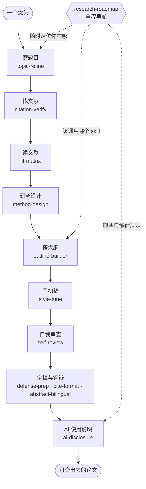

语言：[繁體中文](README.md) | [简体中文](README.zh-CN.md)

<div align="center">

# 人文社科 AI 研究技能库

### 文科生的 AI 研究工作流

**给不会写代码的文科 / 人文社科研究者的 Claude Code / Codex skill 库，从选题、查文献、读文献、研究设计到写论文、预审和答辩。**

*A Claude Code / Codex skill collection for liberal-arts researchers — the full path from literature to thesis, no coding required.*

<br/>

[](https://github.com/DylanChiang-Dev/liberal-arts-research-skills/stargazers)
[](https://github.com/DylanChiang-Dev/liberal-arts-research-skills/network/members)
[](LICENSE)
[](#十二个-skill)
[](#)

</div>

---

> 本仓库是一套给文科 / 人文社科研究者使用的 AI 研究 skill 库，整理从磨题、核查引用、读文献、研究设计、搭大纲、写初稿、自我审查到答辩准备的完整工作流。所有 skill 以真实研究材料实测打磨，可在 Claude Code / Codex 等支持 agent skills 的环境中使用。

一句话讲清楚这个仓库在做什么：**把导师脑子里那种“看三篇文献就知道这题能不能做”的判断，尽量拆成明白的规则与提问，写成你随时叫得动的流程。** 它缩小信息差，但不替你做研究。

## 适用人群

- 中国大陆高校硕士生、博士生。
- 人文社科、教育、传播、公共管理、政治学、社会学、法学、艺术学等方向的研究者。
- 正在写课程论文、开题报告、硕士论文、博士论文、投稿论文的人。
- 想把 AI 用在研究流程里，但不希望变成“整篇代写”或“自动论文机”的人。

## 核心信念

> ### AI 是副驾驶，不是机长。

- **苦工外包，判断自留。** skill 可以处理检索、核查、格式、模拟提问；研究问题、方法选择与解释，永远是你的。
- **凡引用必回源。** skill 只证明文献存在，不证明它支持你的论点。
- **透明而非遮掩。** 全部 skill 鼓励留痕与 AI 使用说明，目标是质量，不是隐藏协作事实。
- **人工带路，不是一键跑完。** 这不是全自动论文机。每一步 AI 干活，你握方向盘。

## 工作流地图

从一个念头到一篇可以交出去的论文，十二个 skill 各守一段，`research-roadmap` 在最上层导航：



## 十二个 skill

> **九个核心**（逐阶段工作）+ **两个收尾**（定稿阶段）+ **一个导航**（全程定位）= **十二个**。同一套 skill 可用于繁体中文、简体中文与中英混合研究材料。

### 核心：一阶段一个

| skill | 功能 | 阶段 |
|---|---|---|
| [`topic-refine`](skills/topic-refine) | 苏格拉底式磨题：问题意识 → 有界发散 → 三问收敛（新 / 可行 / 谁在乎）→ 导师模拟质询 → 一页研究问题简报；只追问不替你定题 | 磨题 |
| [`citation-verify`](skills/citation-verify) | 引用核查：用 Crossref / OpenAlex / Semantic Scholar 等公开 API 验证参考文献是否真实存在，并标出 DOI 贴错、拆名、疑似虚构引用 | 找文献 |
| [`lit-matrix`](skills/lit-matrix) | 文献精读与矩阵：单篇四栏笔记（主张 / 证据 / 方法 / 可挑战处）、跨篇对照矩阵、综述对话地图 | 读文献 |
| [`method-design`](skills/method-design) | 研究设计：方法地图、访谈提纲 / 问卷初稿 + 人工校准、角色扮演预访谈、编码建议（解释留给你）、统计误区核查 | 设计 |
| [`outline-builder`](skills/outline-builder) | 论文骨架：选择结构模式（IMRaD / 综述 / 思辨 / 政策分析）、生成大纲、设计段落论证链 claim-evidence-warrant | 大纲 |
| [`style-tune`](skills/style-tune) | 声音校准：用旧文让 AI 学你的文风、段落级润色（守住整篇代写红线）、中文学术 AI 腔识别清单 | 初稿 |
| [`self-review`](skills/self-review) | 自我审查（模拟审查）：方法论 / 领域 / 魔鬼代言人 / 主编多角色审稿 + 学术诚信自查 + 意见分级 | 预审 |
| [`defense-prep`](skills/defense-prep) | 答辩准备：论文 → 汇报骨架、分层出难题（澄清 / 方法 / 理论 / 贡献 / 陷阱）、答辩策略（含英文） | 答辩 |
| [`ai-disclosure`](skills/ai-disclosure) | AI 使用说明：盘点使用 → 抄袭 / 代写 / 辅助三分法 → 按学校或期刊要求生成诚实具体的 AI 使用说明 → 留痕自证 | 说明 |

### 收尾：定稿阶段

| skill | 功能 | 阶段 |
|---|---|---|
| [`cite-format`](skills/cite-format) | 引用格式整理：APA / Chicago / MLA 或学校模板转换与全文统一，检查正文引注与文末清单是否一一对应；只管格式不验真伪 | 格式 |
| [`abstract-bilingual`](skills/abstract-bilingual) | 中英双语摘要：从定稿浓缩中文摘要 + 英文摘要（按英文惯例重写，非逐字翻译）+ 中英关键词；只浓缩不新增，数字逐一核对 | 摘要 |

### 导航：全程定位

| skill | 功能 | 阶段 |
|---|---|---|
| [`research-roadmap`](skills/research-roadmap) | 全流程导航：判断你在哪一阶段、该调用哪个 skill、哪些关卡只有你能决定、什么时候算过关；只导航不代跑 | 导航 |

## 安装

### 方式一：一句话交给 Claude Code 或 Codex

打开 Claude Code 或 Codex，把这句话贴进去：

```text
帮我从 https://github.com/DylanChiang-Dev/liberal-arts-research-skills 安装 citation-verify 技能
```

它会下载仓库、把 skill 文件放到合适位置、回报装了什么。想一次安装全部，把 `citation-verify` 换成“所有技能”。

### 方式二：手动复制到 Codex

Codex 读取 `.agents/skills` 与 `~/.agents/skills`。每个 skill 目录只要包含 `SKILL.md` 就能被识别。

```bash
git clone https://github.com/DylanChiang-Dev/liberal-arts-research-skills.git

# 全局安装（所有项目可用）
mkdir -p ~/.agents/skills
cp -r liberal-arts-research-skills/skills/* ~/.agents/skills/

# 或只安装到当前项目
mkdir -p .agents/skills
cp -r liberal-arts-research-skills/skills/* .agents/skills/
```

装好后在 Codex 里可用 `$citation-verify` 这类明确调用，也可以直接用自然语言触发，例如：“帮我核查这份参考文献的真伪”。

### 方式三：手动复制到 Claude Code

```bash
git clone https://github.com/DylanChiang-Dev/liberal-arts-research-skills.git

# 全局安装（所有项目可用）
mkdir -p ~/.claude/skills
cp -r liberal-arts-research-skills/skills/* ~/.claude/skills/

# 或只安装到当前项目
mkdir -p .claude/skills
cp -r liberal-arts-research-skills/skills/* .claude/skills/
```

装好后在 Claude Code 里直接用自然语言触发，例如：“帮我核查这份参考文献的真伪”。

## 中国大陆高校使用注意

这套 skill 的底层方法适用于大陆硕博论文，但使用时要把**术语、数据库、引用格式和 AI 使用要求**换成本校 / 本院 / 本刊的现行规定。

### 术语对照

| 繁体 / 台湾语境 | 简体 / 大陆语境 |
|---|---|
| 文組 | 文科 / 人文社科 |
| 碩士論文 / 碩論 | 硕士论文 |
| 博碩士 | 硕博 |
| 口試 | 答辩 |
| 指導教授 | 导师 |
| AI 使用揭露 | AI 使用说明 / AI 使用声明 |
| 期刊 / 學校格式 | 学校模板 / 投稿要求 |
| 查核 | 核查 |

### 文献核查

`citation-verify` 会优先使用 Crossref / OpenAlex / Semantic Scholar。它们适合核查英文期刊、预印本、部分中文文献和带 DOI 的条目，但不能覆盖所有大陆中文资料。

**API 查不到不等于文献不存在。尤其是中文期刊、专著、学位论文、会议论文、政府文件、报纸资料，必须进入人工回源流程。**

大陆语境建议的人工回源管道：

- 中文期刊：知网、万方、维普、国家哲学社会科学文献中心。
- 学位论文：知网学位论文库、学校图书馆 / 机构库。
- 政策文件：政府官网、部门官网、统计年鉴、政策原文。
- 专著：高校图书馆、国家图书馆、WorldCat、出版社页面。
- 核心来源判断：CSSCI、北大核心、AMI、人大复印报刊资料等只能作为来源层级线索，不能替代回源阅读。

使用原则：

- `✅ 已核实` 只代表文献存在且书目信息基本匹配。
- `❓ 待人工` 不是“假的”，而是需要你去数据库、图书馆或原文页面确认。
- 引用是否真的支持你的论点，必须回到原文阅读，不能只看标题、摘要或 AI 总结。

### 引用格式

大陆高校论文格式优先级：

```text
学校 / 学院模板 > 导师要求 > 期刊投稿要求 > 通用格式
```

若学校要求 GB/T 7714，以学校模板为准。`cite-format` 目前主要提供通用格式整理能力；使用时应把学校模板、学院格式要求或一条正确示例交给 agent，让它按你的目标格式整理。

注意：

- APA / Chicago / MLA 示例只作为通用能力，不默认适用于所有大陆论文。
- 中文文献、英文文献是否分区，排序方式、标点、作者名格式，都以学校模板为准。
- 格式排好不等于文献查证完毕。建议先用 `citation-verify` 核查，再用 `cite-format` 排格式。

### AI 使用说明

大陆高校和期刊对 AI 使用的要求正在快速变化，本库不预设统一答案。使用 `ai-disclosure` 时，应提供学校、学院、课程或期刊的最新原文要求。

本库只帮助你诚实说明：

- 哪些环节用了 AI；
- AI 做了什么；
- 你自己做了什么判断、修改和核实；
- 是否保留了对话、版本、查证记录。

本库不帮助：

- 规避 AIGC 检测；
- 隐藏 AI 使用痕迹；
- 把整篇代写包装成轻度润色；
- 编造不存在的学校政策或期刊要求。

## 实测案例

每个 skill 都拿**真实研究材料**跑过、把暴露的坑写回规则。案例多来自作者真实硕士论文与教学稿，用来说明这些 skill 在真实写作和修改过程中会抓到什么问题。

| # | 案例 | 一句话战果 |
|---|---|---|
| 001 | [citation-verify 查作者硕士论文](examples/2026-06-12-master-thesis-case.md) | 47 笔全量核查，抓到 3 笔 DOI 贴错、1 笔拆名、11 笔出处不全 |
| 002 | [lit-matrix 整理硕士论文文献](examples/2026-06-13-litmatrix-thesis-litreview.md) | 5 篇异质文献分群做矩阵，暴露“引用语境不等于主题” |
| 003 | [self-review 审教学稿](examples/2026-06-13-selfreview-teaching-chapter.md) | 暴露文稿类型错配、证据与宣称规模不相称、绝对宣称 |
| 004 | [defense-prep 模拟硕士论文答辩](examples/2026-06-14-defenseprep-thesis.md) | 分层出真问题，暴露论文阶段误判与质性可推论性问题 |
| 005 | [topic-refine 磨“两岸关系”题](examples/2026-06-14-topicrefine-cross-strait.md) | 在资料可得性上踩出红灯，示范换做法保住问题意识 |
| 006 | [method-design 检视硕士论文设计](examples/2026-06-14-methoddesign-thesis.md) | 暴露对象分层不清、AI 扮受访者过于配合 |
| 007 | [outline-builder 检视硕士论文骨架](examples/2026-06-14-outlinebuilder-thesis.md) | 暴露完整性幻觉与 warrant 缺席 |
| 008 | [style-tune 扫硕士论文 AI 腔](examples/2026-06-14-styletune-thesis.md) | 发现谈 GenAI 的论文绪论本身读起来像 AI 生成 |
| 009 | [ai-disclosure 处理重度 AI 协作声明](examples/2026-06-14-aidisclosure-heavy-ai-use.md) | 暴露重度使用时 AI 倾向淡化使用程度 |
| 010 | [abstract-bilingual 生成硕士论文中英摘要](examples/2026-06-14-abstractbilingual-thesis.md) | 抓到中英关键词不对齐与“显著”误用问题 |
| 011 | [cite-format 排硕士论文参考文献](examples/2026-06-14-citeformat-thesis.md) | 坐实“先验后排”：未核查清单只是错资料的漂亮包装 |
| 012 | [research-roadmap 导航完整研究工作流](examples/2026-06-14-researchroadmap-workflow.md) | 抓到最大退化“流程朗读机”：要按产出物定位，而不是按线性顺序 |

## 设计原则

- **单文件 skill**：每个 skill 一个 `SKILL.md`，看得懂、改得动，欢迎 fork 改造成你的领域版本。
- **不编造**：所有 skill 内置“查不到就标注、不确定就说明”的硬规则。
- **用—磨—写**：每个 skill 都先拿真实材料跑，把坑写回规则，才升版本号。
- **中文优先**：为华语人文社科研究场景设计；大陆使用时请按本校模板、数据库和政策要求调整。

## 版本策略

| 版本号 | 意义 |
|---|---|
| `0.0.X` | 打磨轮：任何 skill 经实测修订一轮，尾号 +1 |
| `0.X.0` | 新 skill 发布或工作流结构调整，中号 +1 |
| `1.0.0` | 全套 skill 稳定版 |

每个版本打 git tag，CHANGELOG 记录在 [`MEMORY.md`](MEMORY.md)。

## 授权与致谢

**MIT License**（版权所有人 Dylan Chiang 蔣濤）——可自由使用、修改、再发布（含商用），保留版权声明即可。

工作流思路受以下公开项目与研究启发，特此致谢：

- [**academic-research-skills**](https://github.com/Imbad0202/academic-research-skills)（ARS）—— 诚信闸门与引用核查的理念方向。
- [**Supervisor-Skills**](https://github.com/HKUSTDial/Supervisor-Skills)（HKUST）—— 把导师判断编码成 skill、投稿前自审（模拟审查）的立意。
- **The AI Scientist**（Lu et al., 2024, [arXiv:2408.06292](https://arxiv.org/abs/2408.06292), Sakana AI）—— 全自动化研究的失败模式。
- **Zhao et al.（2026）** —— 对幻觉引用的大规模实证。

> 仅借鉴理念方向与问题意识，**提示语、结构、案例全部原创自制**。这份分寸，也是本库坚持的学术诚信。
