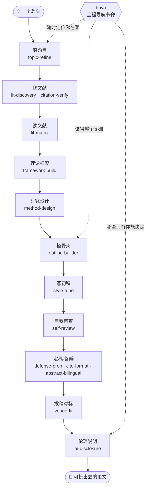

语言：[繁體中文](README.md) | [简体中文](README.zh-CN.md) | [English](README.en.md) | [日本語](README.ja.md)

<div align="center">

# 博雅 Boya

### 给文科／人文社科研究者的 AI 论文工作流

**不会写代码，也可以用 Claude Code / Codex，把一篇论文从"模糊题目"一步步推到"可以交出去"。**

<strong>AI 做苦工，你做判断。</strong><br/>
Boya 帮你磨题、查引用、读文献、设计方法、搭大纲、修初稿、自我审查、准备答辩与投稿对标；<br/>
但不替你编文献、不代写结论、不帮你隐藏 AI 使用。

*A Claude Code / Codex workflow for liberal-arts and social-science researchers — from vague idea to submission-ready paper, no coding required.*

<br/>

[](https://github.com/DylanChiang-Dev/boya/stargazers)
[](https://github.com/DylanChiang-Dev/boya/network/members)
[](LICENSE)
[](#十五个-skill)
[](MEMORY.md)
[](#)

</div>

---

如果你正在写论文，Boya 不是要把你变成工程师，而是把导师、研究方法课、投稿前检查清单里那些"没人一次讲清楚"的步骤，拆成 agent 可以陪你走的流程。

你可以从这里开始：

- **题目太大**：把一个模糊想法缩成可研究问题。
- **文献太乱**：查引用真伪，整理文献矩阵与综述线索。
- **初稿要交**：先自我审查、排引用格式、写 AI 使用说明，再准备答辩或投稿。

繁體中文為主要版本，見 [README.md](README.md)。English and Japanese introductions are available in [README.en.md](README.en.md) and [README.ja.md](README.ja.md)。

完整使用手册见 [GUIDE.md](GUIDE.md)：安装后从哪里开始、不同研究阶段该用哪个 skill、templates / knowledge / evals 怎么配合。

一句话讲清楚这个仓库在做什么：**把导师脑子里那种"看三篇文献就知道这题能不能做"的判断，尽量拆成明白的规则与提问，写成你随时叫得动的流程。** 它缩小信息差，但不替你做研究。

## 🧭 核心信念

> ### AI 是副驾驶，不是机长。

Boya 的最高设计原则是**人类在环（human-in-the-loop）**：流程可以自动接力，但每一个"只有你能决定"的关卡都会**硬停下来等你拍板**——这也是它和"全自动论文机"的唯一分界。底下四条，都是这个原则的展开。

- **苦工外包，判断自留。** skill 处理检索、核查、格式、模拟提问；研究问题、方法选择与诠释，永远是你的。
- **凡引用必回源。** skill 只证明文献存在，不证明它支持你的论点。
- **透明而非遮掩。** 全部 skill 鼓励留痕与 AI 使用说明，目标是质量，不是隐藏协作事实。
- **人类在环，不是一键跑完。** 这不是全自动论文机——流程会自己接力唤起下一步，但到"只有你能决定"的关卡就停；每一步 AI 干活、你握方向盘。

## 🗺️ 工作流地图

从一个念头到一篇可以投出去的论文，十五个 skill 各守一段，`boya` 在最上层导航：



## 📦 十五个 skill

> **十二个核心**（逐阶段工作）＋ **两个收尾**（定稿阶段）＋ **一个导航**（书脊）＝ **十五个**；目前十五个 skill 均具备真实案例与 evidence ledger，列为 Stable。

### 核心 · 一阶段一个

| skill | 功能 | 阶段 |
|---|---|---|
| [`topic-refine`](skills/topic-refine) | 苏格拉底式磨题：问题意识 → 有界发散 → 三问收敛（新／可行／谁在乎）→ 导师模拟 → 一页研究问题简报；只追问不给答案 | 磨题 |
| [`lit-discovery`](skills/lit-discovery) | 文献探勘：把研究问题拆成检索策略，用 OpenAlex / Crossref / Semantic Scholar 捞**待核候选清单**、按相关性分层；选用"先读哪篇"出处提示（回查 CSSCI／TSSCI／北大核心／AMI核心／SSCI／A&HCI 官方名单、标版次年份，查不到标待查），交棒核查与精读；绝不编造、查无标待人工 | 找文献 |
| [`citation-verify`](skills/citation-verify) | 引用核查：用 Crossref / OpenAlex / Semantic Scholar 公开 API 验证参考文献是否**真实存在**，抓 DOI 贴错、拆名、虚构引用 | 找文献 |
| [`lit-matrix`](skills/lit-matrix) | 文献精读与矩阵：单篇四栏笔记（主张／证据／方法／可挑战处）、跨篇对照矩阵、综述对话地图 | 读文献 |
| [`framework-build`](skills/framework-build) | 理论框架定锚：从文献地图摊候选框架（解释什么／理论代价／库存支撑）、推荐分层（主框架→中介机制→实证抓手→落点）、硬 GATE 让你拍板主框架；另有辅助框架嵌入与逆向体检两模式。 | 框架 |
| [`method-design`](skills/method-design) | 研究设计：方法地图、起草访谈大纲／问卷＋人工校准、角色扮演预访谈、编码建议（诠释留你）、统计谬误核验 | 设计 |
| [`outline-builder`](skills/outline-builder) | 论文骨架：选结构模式（IMRaD／综述／思辨／政策）、长出大纲、段落论证链 claim–evidence–warrant（专补推理桥） | 大纲 |
| [`style-tune`](skills/style-tune) | 声音校准：用旧文让 AI 学你的文风、段落级润稿（守整篇代写红线）、中文学术 AI 腔识别清单 | 初稿 |
| [`self-review`](skills/self-review) | 自我审查（**模拟审查**）：一桌审稿人（方法论／领域／魔鬼代言人／主编）轮审＋诚信自查＋意见分级（必改／可辩／误读） | 自审 |
| [`defense-prep`](skills/defense-prep) | 答辩准备：论文 → 汇报骨架、分层出难题（澄清／方法／理论／贡献／陷阱）、答询策略（含英文） | 答辩 |
| [`venue-fit`](skills/venue-fit) | 投稿对标：用定稿对上目标 venue 的真实作者须知，列出 must-fix／should-fix／待补核查；不编期刊规范、不代决定投哪里 | 投稿 |
| [`ai-disclosure`](skills/ai-disclosure) | AI 使用说明：盘点使用 → 抄袭／代写／辅助三分法 → 按目标机构格式生成诚实具体声明 → 留痕自证 | 说明 |

### 收尾 · 定稿阶段

| skill | 功能 | 阶段 |
|---|---|---|
| [`cite-format`](skills/cite-format) | 引用格式整理：APA／Chicago／MLA 转换与全文统一、随文引注↔文末清单一一对应（抓孤儿）、缺栏位标注不编造；**只管格式不验真伪** | 格式 |
| [`abstract-bilingual`](skills/abstract-bilingual) | 中英双语摘要：从定稿浓缩中文摘要＋英文摘要（按英文惯例重写、非逐字翻译）＋中英关键词；只浓缩不新增、数字逐一核对 | 摘要 |

### 导航 · 书脊

| skill | 功能 | 阶段 |
|---|---|---|
| [`boya`](skills/boya) | 全流程导航与入口（原 `research-roadmap`）：判断你在哪一阶段、该唤哪个 skill、哪些关卡只有你能决定、何时过关；**引导式精灵——自动接力唤起下一个 skill、每关停下等你拍板**，串起其余十四个 | 导航 |

## 🚀 安装

### 方式一：请 agent 自动安装整套 Boya（推荐）

打开 Claude Code 或 Codex 这类 agent，把这句话贴进去：

```text
帮我从 https://github.com/DylanChiang-Dev/boya 安装全部 Boya skills，不要只安装 citation-verify。请先判断我目前的 agent 环境与可用的 skills 目录，说明会写入哪些路径，等我确认后再执行。
```

常见目标路径：

- Claude Code：全局 `~/.claude/skills/`；项目内 `.claude/skills/`
- Codex：全局 `~/.agents/skills/`；项目内 `.agents/skills/`；若使用 Codex 内置 `$skill-installer`，也可能写入 `$CODEX_HOME/skills/`（默认常见为 `~/.codex/skills/`）
- CC Switch：全局 `~/.cc-switch/skills/`

只想安装单一技能时，才把"全部 Boya skills"改成具体 skill 名，例如 `citation-verify`。

### 方式二：手动复制整套 skills

每个 skill 目录只要包含 `SKILL.md` 就能被识别。

**Codex 全局安装（所有项目可用）**

```bash
git clone https://github.com/DylanChiang-Dev/boya.git

mkdir -p ~/.agents/skills
cp -r boya/skills/* ~/.agents/skills/
```

若你的 Codex 明确使用 `$CODEX_HOME/skills/` 加载技能，改用：

```bash
mkdir -p "${CODEX_HOME:-$HOME/.codex}/skills"
cp -r boya/skills/* "${CODEX_HOME:-$HOME/.codex}/skills/"
```

**Codex 项目安装（只给当前项目用）**

```bash
mkdir -p .agents/skills
cp -r boya/skills/* .agents/skills/
```

装好后在 Codex 里可用 `$citation-verify` 这类明确调用，也可以直接用自然语言触发，例如："帮我核查这份参考文献的真伪"。

**Claude Code 全局安装（所有项目可用）**

```bash
mkdir -p ~/.claude/skills
cp -r boya/skills/* ~/.claude/skills/
```

**Claude Code 项目安装（只给当前项目用）**

```bash
mkdir -p .claude/skills
cp -r boya/skills/* .claude/skills/
```

装好后在 Claude Code 里直接用自然语言触发，例如："帮我核查这份参考文献的真伪"。

**CC Switch 全局安装**

```bash
mkdir -p ~/.cc-switch/skills
cp -r boya/skills/* ~/.cc-switch/skills/
```

## 🏫 中国大陆高校使用注意

这套 skill 的底层方法适用于大陆硕博论文，但使用时要把**术语、数据库、引用格式和 AI 使用要求**换成本校／本院／本刊的现行规定。

### 术语对照

| 繁体 / 台湾语境 | 简体 / 大陆语境 |
|---|---|
| 文組 | 文科 / 人文社科 |
| 碩士論文 / 碩論 | 硕士论文 |
| 博碩士 | 硕博 |
| 口試 | 答辩 |
| 指導教授 | 导师 |
| AI 使用揭露 | AI 使用说明 / AI 使用声明 |
| 期刊 / 學校格式 | 学校模板 / 投稿要求 |
| 查核 | 核查 |

### 文献核查

`citation-verify` 会优先使用 Crossref / OpenAlex / Semantic Scholar。它们适合核查英文期刊、预印本、部分中文文献和带 DOI 的条目，但不能覆盖所有大陆中文资料。

**API 查不到不等于文献不存在。尤其是中文期刊、专著、学位论文、会议论文、政府文件、报纸资料，必须进入人工回源流程。**

大陆语境建议的人工回源管道：

- 中文期刊：知网、万方、维普、国家哲学社会科学文献中心。
- 学位论文：知网学位论文库、学校图书馆／机构库。
- 政策文件：政府官网、部门官网、统计年鉴、政策原文。
- 专著：高校图书馆、国家图书馆、WorldCat、出版社页面。
- 核心来源判断：CSSCI、北大核心、AMI、人大复印报刊资料等只能作为来源层级线索，不能替代回源阅读。

使用原则：

- `✅ 已核实` 只代表文献存在且书目信息基本匹配。
- `❓ 待人工` 不是"假的"，而是需要你去数据库、图书馆或原文页面确认。
- 引用是否真的支持你的论点，必须回到原文阅读，不能只看标题、摘要或 AI 总结。

### 引用格式

大陆高校论文格式优先级：

```text
学校 / 学院模板 > 导师要求 > 期刊投稿要求 > 通用格式
```

若学校要求 GB/T 7714，以学校模板为准。`cite-format` 目前主要提供通用格式整理能力；使用时应把学校模板、学院格式要求或一条正确示例交给 agent，让它按你的目标格式整理。

注意：

- APA / Chicago / MLA 示例只作为通用能力，不默认适用于所有大陆论文。
- 中文文献、英文文献是否分区，排序方式、标点、作者名格式，都以学校模板为准。
- 格式排好不等于文献查证完毕。建议先用 `citation-verify` 核查，再用 `cite-format` 排格式。

### AI 使用说明

大陆高校和期刊对 AI 使用的要求正在快速变化，本库不预设统一答案。使用 `ai-disclosure` 时，应提供学校、学院、课程或期刊的最新原文要求。

本库只帮助你诚实说明：

- 哪些环节用了 AI；
- AI 做了什么；
- 你自己做了什么判断、修改和核实；
- 是否保留了对话、版本、查证记录。

本库不帮助：

- 规避 AIGC 检测；
- 隐藏 AI 使用痕迹；
- 把整篇代写包装成轻度润色；
- 编造不存在的学校政策或期刊要求。

## 🔬 实测案例

每个 skill 都拿**真实研究材料**跑过、把暴露的坑写回规则——多数用在作者自己那本硕士论文上，是一条工作流全链的真实示范。

验证状态采三层：`Draft`（草稿，尚未形成证据链）、`Beta`（可用但仍在磨）、`Stable`（已用真实材料跑过并写回规则）。目前 15 个 skill 均为 **Stable**；知识表中的单笔事实仍可保留 `❓/待补`，不影响 skill 稳定状态。证据链、最小 evidence ledger、source map／action map 规格见 [`VERIFICATION.md`](VERIFICATION.md)。

| # | 案例 | 一句话战果 |
|---|---|---|
| 001 | [citation-verify 查作者硕论](examples/2026-06-12-master-thesis-case.md) | 47 笔全量核查，抓到 **3 笔 DOI 贴错**、1 笔拆名、11 笔出处不全，附公开勘误表 |
| 002 | [lit-matrix 整理硕论文献](examples/2026-06-13-litmatrix-thesis-litreview.md) | 5 篇异质文献分群做矩阵；暴露"引用语境≠主题／异质语料分群" |
| 003 | [self-review 审教学稿](examples/2026-06-13-selfreview-teaching-chapter.md) | 暴露"文稿类型错配／证据-宣称规模不相称／绝对宣称" |
| 004 | [defense-prep 模拟硕论答辩](examples/2026-06-14-defenseprep-thesis.md) | 分层出真考题；暴露"论文阶段误判／漏质性可推论性" |
| 005 | [topic-refine 磨"两岸关系"题](examples/2026-06-14-topicrefine-cross-strait.md) | 在"日台非官方安全"踩出可行性红灯（资料闭门），示范换做法保住问题 |
| 006 | [method-design 检视硕论设计](examples/2026-06-14-methoddesign-thesis.md) | 暴露"对象分层要想清楚／AI 扮受访者太乖" |
| 007 | [outline-builder 检视硕论骨架](examples/2026-06-14-outlinebuilder-thesis.md) | 暴露"完整性幻觉（齐全≠论证线）／warrant 缺席" |
| 008 | [style-tune 扫硕论 AI 腔](examples/2026-06-14-styletune-thesis.md) | 一本谈 GenAI 的论文绪论本身读起来像 AI 生成；暴露"AI 腔的专业伪装" |
| 009 | [ai-disclosure 处理重度 AI 协作声明](examples/2026-06-14-aidisclosure-heavy-ai-use.md) | 暴露"重度使用时 AI 不敢说" |
| 010 | [abstract-bilingual 生硕论中英摘要](examples/2026-06-14-abstractbilingual-thesis.md) | 抓到"官方关键词中英本身不对齐／'显著'是统计词别照搬" |
| 011 | [cite-format 排硕论参考文献](examples/2026-06-14-citeformat-thesis.md) | 坐实"先验后排——未核查清单＝错资料的漂亮包装" |
| 012 | [boya（原 research-roadmap）导航完整研究工作流](examples/2026-06-14-researchroadmap-workflow.md) | 抓到最大退化"目录朗读机"——要依产出物倒推、非按线性顺序 |
| 013 | [venue-fit 对标作者硕论与《公共行政学报》](examples/2026-06-18-venuefit-thesis-jpa.md) | 坐实"不编作者须知"与"学位论文转期刊先判文稿类型"，作为 venue-fit 首轮实测 |
| 014 | [framework-build 定锚日台半导体框架](examples/2026-06-21-framework-jasm.md) | 固化理论框架定锚：不堆框架沙拉、不编承重文献、硬 GATE 让研究者拍板主框架 |
| 015 | [outline-builder 搭 silicon sampling 思辨型大纲](examples/2026-06-27-outlinebuilder-silicon-sampling.md) | 正向搭骨架实测 topic-sentence 前置，撞出思辨型两坑：让步句冒充主题句、段主题句覆读章论点 |
| 016 | [lit-discovery 中文题全链探勘](examples/2026-06-30-litdiscovery-genai-assessment-taiwan.md) | 中文精准题名反查命中真实 DOI，补齐"中文题探勘→候选分层→venue 待查"全链 |
| 017 | [framework-build 台湾碳费政策分析框架](examples/2026-06-30-framework-carbon-fee-policy.md) | 补足政策分析型分流：政策问题、分析维度、评估准则、政策代价与 GATE 全跑通 |
| 018 | [venue-fit 对标 JALT 英文高教评量稿](examples/2026-06-30-venuefit-jalt-genai-assessment.md) | 核 JALT submissions page，坐实文章页不等于作者须知、AI 揭露与 APA 7 必须回真实来源 |

## 🧱 设计原则

- **人类在环（human-in-the-loop）**：全库最高原则——流程会自动接力唤起下一步，但每个"只有你能决定"的关卡都硬停下来等你拍板。这是 boya 与"全自动论文机"的分界，底下其余原则都服务于它。
- **单文件 skill**：每个 skill 一个 `SKILL.md`，看得懂、改得动，欢迎 fork 改造成你的领域版本。
- **不编造**：所有 skill 内建"查无即标注、不确定即说明"的硬规则。
- **用—磨—写**：每个 skill 都先拿真实材料跑、把坑写回规则，才升版号——不闭门造框架。
- **中文优先**：为华语人文社科研究场景设计（含台湾学术环境的引用与政策语境）。
- **轻量参考层**：`VERIFICATION.md` 汇总实测证据，`knowledge/` 放 venue 与中文学术写作速查卡，`templates/` 放可填空论文与答辩骨架。
- **不做重型自动化框架**：不引入 `_shared/` fragments、`manifest.yaml` 分片加载、多 agent 长跑 orchestrator；除非某个 skill 真的长到不可读，才把少量共用材料外移。

## 💬 加入讨论

有问题、用法反馈、想分享自己改的版本？欢迎进群聊：

<table>
<tr>
<td align="center"><b>微信群</b><br/>博雅 skills<br/><sub>（二维码有时效，过期请开 issue 回报，作者会更新）</sub></td>
<td align="center"><b>Telegram 群</b></td>
</tr>
<tr>
<td align="center"></td>
<td align="center"></td>
</tr>
</table>

## ⭐ Star 趋势

如果这个仓库帮到你，按颗星——让更多卡在论文里、身边没有人可商量的文科生看到它。

[](https://star-history.com/#DylanChiang-Dev/boya&Date)

## 🏷️ 版本策略

| 版本号 | 意义 |
|---|---|
| `0.0.X` | 打磨轮——任何 skill 经实测修订一轮，尾号 +1 |
| `0.X.0` | 新 skill 发布或工作流结构调整，中号 +1 |
| `1.0.0` | 全套 skill 稳定版 |

每个版本打 git tag，CHANGELOG 记在 [`MEMORY.md`](MEMORY.md#changelog)。

## 📄 授权与致谢

**MIT License**（版权人 Dylan Chiang 蒋涛）——可自由使用、修改、再发布（含商用），保留版权声明即可。

工作流思路受以下公开项目与研究启发，特此致谢：

- [**academic-research-skills**](https://github.com/Imbad0202/academic-research-skills)（ARS）—— 诚信闸门与引用核查的理念方向
- [**Supervisor-Skills**](https://github.com/HKUSTDial/Supervisor-Skills)（HKUST）—— 把导师判断编码成 skill、投稿前自审（模拟审查）的立意
- **The AI Scientist**（Lu et al., 2024, [arXiv:2408.06292](https://arxiv.org/abs/2408.06292), Sakana AI）—— 全自动化研究的失败模式
- **Zhao et al.（2026）** —— 对幻觉引用的大规模实证
- [**彭思达公开研究笔记**](https://pengsida.notion.site/c1a22465a0fa4b15a12985223916048e) —— 论文段落写作方法（主题句前置、反向大纲）的理念启发；仅借鉴方法理念，规则与行文原创重写

> 仅借鉴理念方向与问题意识，**提示语、结构、案例全部原创自制**——零内容转述、不抄 prompt、不用截图。这份分寸，也是本库坚持的学术诚信。
